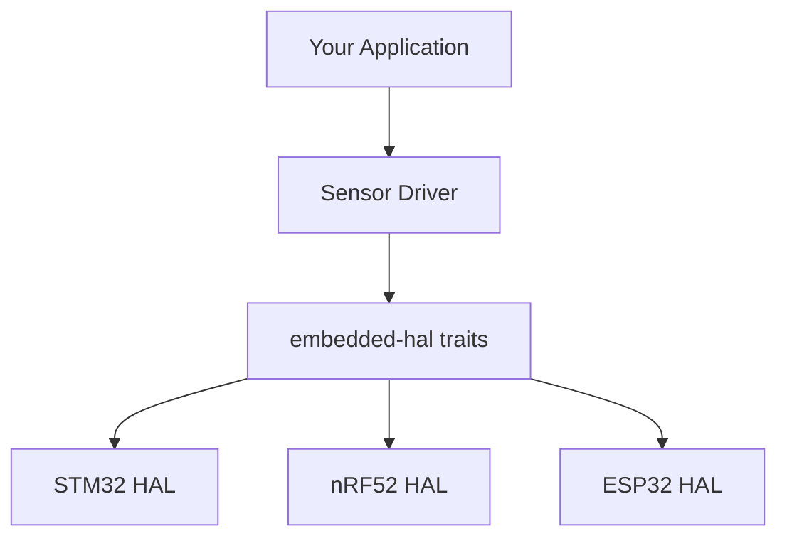

# Embedded HAL

The Hardware Abstraction Layer for portable embedded Rust.

## What is embedded-hal?

`embedded-hal` defines traits for common hardware peripherals, enabling:
- **Portable drivers** - Write once, run on any chip
- **Reusable code** - Share between projects
- **Ecosystem** - Large library of compatible drivers



## Core Traits

### Digital I/O

```rust
use embedded_hal::digital::{InputPin, OutputPin, StatefulOutputPin};

fn blink<P: OutputPin>(led: &mut P) {
    led.set_high().ok();
    // delay
    led.set_low().ok();
}

fn read_button<P: InputPin>(button: &P) -> bool {
    button.is_high().unwrap_or(false)
}
```

### SPI

```rust
use embedded_hal::spi::SpiDevice;

fn write_register<SPI: SpiDevice>(spi: &mut SPI, reg: u8, value: u8) -> Result<(), SPI::Error> {
    spi.write(&[reg, value])
}

fn read_register<SPI: SpiDevice>(spi: &mut SPI, reg: u8) -> Result<u8, SPI::Error> {
    let mut buf = [0u8; 1];
    spi.transfer(&mut buf, &[reg | 0x80])?;
    Ok(buf[0])
}
```

### I2C

```rust
use embedded_hal::i2c::I2c;

const SENSOR_ADDR: u8 = 0x48;

fn read_temperature<I: I2c>(i2c: &mut I) -> Result<i16, I::Error> {
    let mut buf = [0u8; 2];
    i2c.write_read(SENSOR_ADDR, &[0x00], &mut buf)?;
    Ok(i16::from_be_bytes(buf))
}

fn write_config<I: I2c>(i2c: &mut I, config: u8) -> Result<(), I::Error> {
    i2c.write(SENSOR_ADDR, &[0x01, config])
}
```

### UART/Serial

```rust
use embedded_hal::serial::{Read, Write};
use embedded_io::{Read as _, Write as _};

fn echo<S: Read + Write>(serial: &mut S) -> Result<(), S::Error> {
    let mut buf = [0u8; 1];
    serial.read(&mut buf)?;
    serial.write(&buf)?;
    Ok(())
}
```

### Delay

```rust
use embedded_hal::delay::DelayNs;

fn wait_ms<D: DelayNs>(delay: &mut D, ms: u32) {
    delay.delay_ms(ms);
}

fn blink_led<P: OutputPin, D: DelayNs>(led: &mut P, delay: &mut D) {
    loop {
        led.set_high().ok();
        delay.delay_ms(500);
        led.set_low().ok();
        delay.delay_ms(500);
    }
}
```

### PWM

```rust
use embedded_hal::pwm::SetDutyCycle;

fn set_brightness<P: SetDutyCycle>(pwm: &mut P, percent: u8) {
    let max = pwm.max_duty_cycle();
    let duty = (max as u32 * percent as u32 / 100) as u16;
    pwm.set_duty_cycle(duty).ok();
}
```

### ADC

```rust
use embedded_hal::adc::OneShot;

fn read_voltage<ADC, PIN>(adc: &mut ADC, pin: &mut PIN) -> u16
where
    ADC: OneShot<ADC, u16, PIN>,
{
    adc.read(pin).unwrap_or(0)
}
```

## Writing a Portable Driver

Example: A temperature sensor driver that works on any platform.

```rust
use embedded_hal::i2c::I2c;

pub struct Tmp102<I2C> {
    i2c: I2C,
    address: u8,
}

impl<I2C: I2c> Tmp102<I2C> {
    pub fn new(i2c: I2C, address: u8) -> Self {
        Self { i2c, address }
    }

    pub fn read_temperature(&mut self) -> Result<f32, I2C::Error> {
        let mut buf = [0u8; 2];
        self.i2c.write_read(self.address, &[0x00], &mut buf)?;

        let raw = i16::from_be_bytes(buf) >> 4;
        Ok(raw as f32 * 0.0625)
    }

    pub fn set_extended_mode(&mut self, extended: bool) -> Result<(), I2C::Error> {
        let config = if extended { 0x10 } else { 0x00 };
        self.i2c.write(self.address, &[0x01, config, 0x00])
    }
}
```

Usage on any platform:

```rust
// On STM32
use stm32f4xx_hal::{i2c::I2c, pac};

let i2c = I2c::new(dp.I2C1, (scl, sda), 100.kHz(), &clocks);
let mut sensor = Tmp102::new(i2c, 0x48);
let temp = sensor.read_temperature().unwrap();

// On nRF52
use nrf52840_hal::twim::Twim;

let i2c = Twim::new(dp.TWIM0, pins, Frequency::K100);
let mut sensor = Tmp102::new(i2c, 0x48);
let temp = sensor.read_temperature().unwrap();
```

## HAL Implementations

| Chip Family | HAL Crate |
|-------------|-----------|
| STM32 | `stm32f4xx-hal`, `stm32h7xx-hal`, etc. |
| nRF | `nrf52840-hal`, `nrf52832-hal` |
| ESP32 | `esp-hal` |
| RP2040 | `rp2040-hal` |
| AVR | `avr-hal` |
| RISC-V | `e310x-hal` |

## Project Structure

```
my-embedded-project/
├── Cargo.toml
├── .cargo/
│   └── config.toml
├── memory.x           # Linker script
└── src/
    └── main.rs
```

Example Cargo.toml for STM32F4:

```toml
[package]
name = "my-embedded-app"
version = "0.1.0"
edition = "2021"

[dependencies]
cortex-m = "0.7"
cortex-m-rt = "0.7"
panic-halt = "0.2"
stm32f4xx-hal = { version = "0.17", features = ["stm32f411"] }
embedded-hal = "1.0"

[profile.release]
opt-level = "s"     # Optimize for size
lto = true
debug = true        # Keep debug info for stack traces
```

## Example: Blinking LED on STM32

```rust
#![no_std]
#![no_main]

use cortex_m_rt::entry;
use panic_halt as _;
use stm32f4xx_hal::{pac, prelude::*};

#[entry]
fn main() -> ! {
    let dp = pac::Peripherals::take().unwrap();
    let cp = cortex_m::Peripherals::take().unwrap();

    let rcc = dp.RCC.constrain();
    let clocks = rcc.cfgr.sysclk(48.MHz()).freeze();

    let gpioc = dp.GPIOC.split();
    let mut led = gpioc.pc13.into_push_pull_output();

    let mut delay = cp.SYST.delay(&clocks);

    loop {
        led.set_high();
        delay.delay_ms(500u32);
        led.set_low();
        delay.delay_ms(500u32);
    }
}
```

## Common Driver Crates

| Driver | Device | Traits Used |
|--------|--------|-------------|
| `bme280` | Temp/humidity sensor | I2C |
| `ssd1306` | OLED display | I2C, SPI |
| `ws2812-spi` | RGB LEDs | SPI |
| `max7219` | LED matrix | SPI |
| `enc28j60` | Ethernet | SPI |
| `sdmmc` | SD card | SPI |

## Best Practices

1. **Use embedded-hal traits** in driver APIs
2. **Avoid platform-specific code** in drivers
3. **Return Results** instead of panicking
4. **Document register access** clearly
5. **Provide examples** for common platforms

## Summary

| Trait | Purpose |
|-------|---------|
| `InputPin` / `OutputPin` | GPIO |
| `SpiDevice` | SPI bus |
| `I2c` | I2C bus |
| `Read` / `Write` | Serial |
| `DelayNs` | Timing |
| `SetDutyCycle` | PWM |

## See Also

- [Example Code](https://github.com/MichaelTien8901/rust-guide-tutorial/tree/main/examples/part6/embedded-hal)

## Next Steps

Learn about [Kernel Modules]() with Rust-for-Linux.
