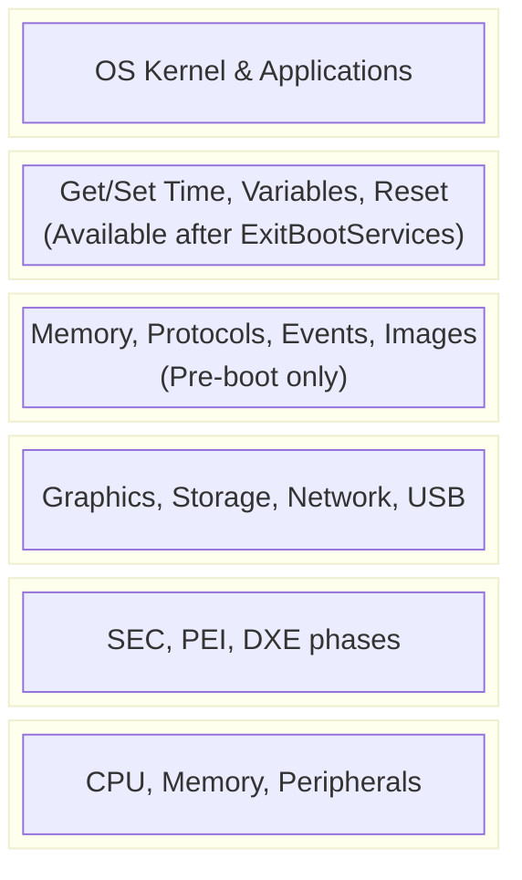
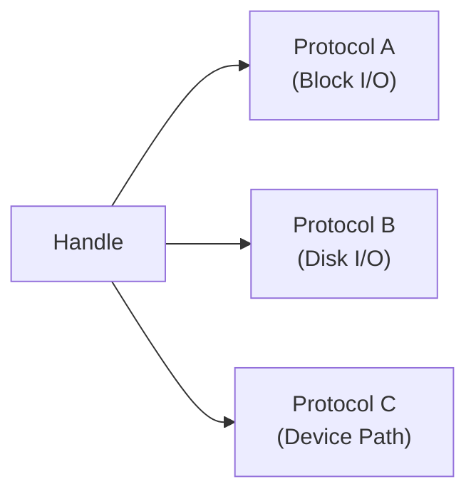

# UEFI Introduction

Understanding UEFI architecture and why Rust is ideal for firmware development.

## What is UEFI?

UEFI (Unified Extensible Firmware Interface) is the modern replacement for BIOS:

| Aspect | BIOS | UEFI |
|--------|------|------|
| Bit mode | 16-bit real mode | 32/64-bit protected mode |
| Boot disk | MBR (2TB limit) | GPT (9ZB limit) |
| Drivers | ROM-based | Modular, loadable |
| Interface | Interrupt-based | Function call tables |
| Networking | None | Built-in stack |
| Security | None | Secure Boot |

## UEFI Architecture



## UEFI Boot Phases

| Phase | Name | Purpose |
|-------|------|---------|
| SEC | Security | CPU init, temp RAM, verify PEI |
| PEI | Pre-EFI Init | Memory init, recovery |
| DXE | Driver Execution | Load drivers, protocols |
| BDS | Boot Device Select | Boot manager, OS selection |
| RT | Runtime | Services for running OS |

## Key UEFI Concepts

### System Table

The central data structure providing access to all UEFI services:

```rust
// Conceptual structure (simplified)
struct SystemTable {
    header: TableHeader,
    firmware_vendor: *const u16,
    firmware_revision: u32,
    console_in_handle: Handle,
    con_in: *mut SimpleTextInput,
    console_out_handle: Handle,
    con_out: *mut SimpleTextOutput,
    stderr_handle: Handle,
    std_err: *mut SimpleTextOutput,
    runtime_services: *mut RuntimeServices,
    boot_services: *mut BootServices,
    number_of_table_entries: usize,
    configuration_table: *mut ConfigurationTable,
}
```

### Boot Services vs Runtime Services

| Boot Services | Runtime Services |
|--------------|------------------|
| Memory allocation | Get/Set time |
| Protocol handling | UEFI variables |
| Image loading | Virtual memory |
| Event timers | Reset system |
| **Unavailable after ExitBootServices** | **Always available** |

### Protocols

Protocols are UEFI's plugin system - interfaces identified by GUIDs:

```rust
// Example protocol GUID
const SIMPLE_TEXT_OUTPUT_PROTOCOL_GUID: Guid = Guid::from_values(
    0x387477c2,
    0x69c7,
    0x11d2,
    [0x8e, 0x39, 0x00, 0xa0, 0xc9, 0x69, 0x72, 0x3b]
);
```

### Handles

Handles are opaque pointers to firmware objects that support protocols:



## Why Rust for UEFI?

### Memory Safety

UEFI code runs with full system privileges. Memory bugs are catastrophic:

| Issue | C/C++ | Rust |
|-------|-------|------|
| Buffer overflow | Common | Prevented |
| Use after free | Common | Prevented |
| Null pointer | Common | Option type |
| Data races | Possible | Compile error |

### No Standard Library Needed

Rust's `#![no_std]` is perfect for firmware:

```rust
#![no_std]
#![no_main]

use uefi::prelude::*;

#[entry]
fn main(_image_handle: Handle, mut system_table: SystemTable<Boot>) -> Status {
    // Full Rust, no libc dependency
    Status::SUCCESS
}
```

### Type Safety for Protocols

Rust can encode protocol requirements in the type system:

```rust
// This only compiles if the protocol is actually available
fn print_message(output: &mut Output) -> Result {
    output.output_string(cstr16!("Hello from Rust!\n"))
}
```

### Algebraic Data Types

Model UEFI states precisely:

```rust
enum BootPhase {
    BootServices(SystemTable<Boot>),
    RuntimeOnly(SystemTable<Runtime>),
}

// Can't accidentally use boot services after exit
fn after_exit(table: SystemTable<Runtime>) {
    // table.boot_services() - won't compile!
    table.runtime_services().get_time();
}
```

## The uefi Crate

The `uefi` crate provides safe Rust bindings to UEFI:

```toml
[dependencies]
uefi = "0.32"
```

Key features:
- Safe abstractions over raw UEFI calls
- Compile-time protocol safety
- Standard Rust error handling
- No unsafe code in user applications

### Crate Structure

| Module | Purpose |
|--------|---------|
| `uefi::prelude` | Common imports |
| `uefi::proto` | Protocol definitions |
| `uefi::table` | System/Boot/Runtime tables |
| `uefi::mem` | Memory types |
| `uefi::data_types` | UEFI data types |

## UEFI Application Types

| Type | Extension | Purpose |
|------|-----------|---------|
| Application | `.efi` | Boot utilities, OS loaders |
| Boot Service Driver | `.efi` | Pre-boot drivers |
| Runtime Driver | `.efi` | Persistent drivers |

## Development Environment

You'll need:

1. **Rust nightly** (for UEFI target)
2. **UEFI target**: `x86_64-unknown-uefi`
3. **QEMU**: For testing with OVMF
4. **OVMF**: Open-source UEFI firmware

## Summary

| Concept | Description |
|---------|-------------|
| UEFI | Modern firmware interface |
| System Table | Central service access |
| Boot Services | Pre-boot APIs |
| Runtime Services | OS-available APIs |
| Protocols | Interface plugins |
| `uefi` crate | Safe Rust bindings |

## Next Steps

Set up your UEFI development environment in [UEFI Setup]().
