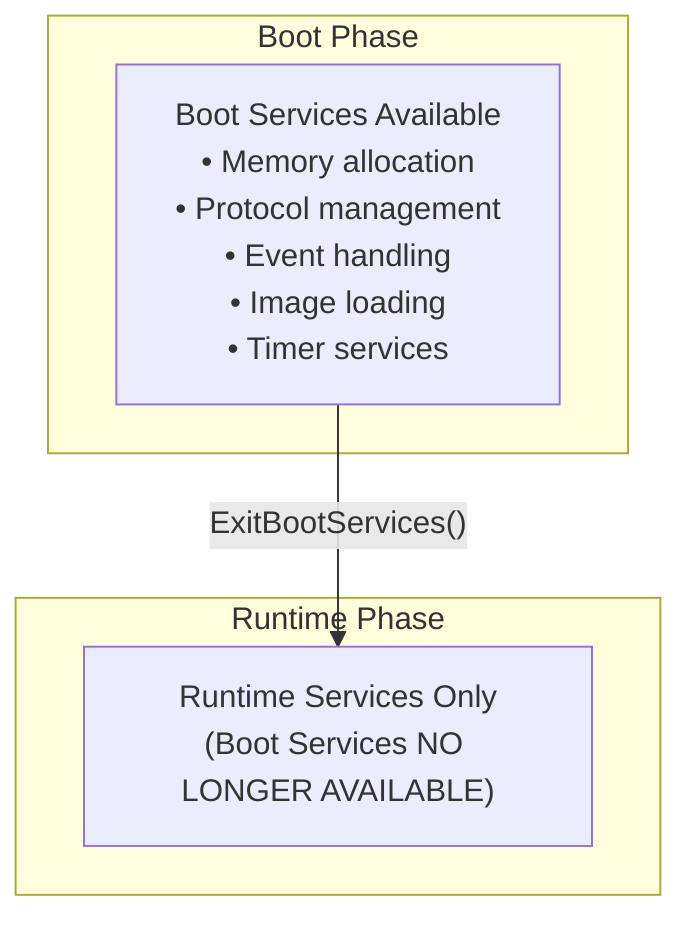

# Boot Services

Memory management, event handling, and image loading during boot.

## Boot Services Overview

Boot services are available only during the pre-boot phase:



## Memory Services

### Memory Types

| Type | Description | After ExitBootServices |
|------|-------------|------------------------|
| `CONVENTIONAL` | Free memory for OS use | Available |
| `LOADER_CODE` | Boot loader code | Available |
| `LOADER_DATA` | Boot loader data | Available |
| `BOOT_SERVICES_CODE` | UEFI boot code | Available |
| `BOOT_SERVICES_DATA` | UEFI boot data | Available |
| `RUNTIME_SERVICES_CODE` | UEFI runtime code | Reserved |
| `RUNTIME_SERVICES_DATA` | UEFI runtime data | Reserved |
| `ACPI_RECLAIM` | ACPI tables | Reclaimable |
| `ACPI_NVS` | ACPI NVS memory | Reserved |
| `RESERVED` | Firmware reserved | Reserved |

### Allocating Memory

```rust
use uefi::prelude::*;
use uefi::table::boot::{AllocateType, MemoryType};

fn allocate_memory(bt: &BootServices) -> uefi::Result<*mut u8> {
    // Allocate pages (4KB each)
    let num_pages = 10;
    let address = bt.allocate_pages(
        AllocateType::AnyPages,
        MemoryType::LOADER_DATA,
        num_pages,
    )?;

    log::info!("Allocated {} pages at {:#x}", num_pages, address);

    Ok(address as *mut u8)
}

fn free_memory(bt: &BootServices, address: u64, pages: usize) -> uefi::Result {
    unsafe {
        bt.free_pages(address, pages)?;
    }
    Ok(())
}
```

### Pool Allocation

For smaller, arbitrary-sized allocations:

```rust
fn allocate_pool(bt: &BootServices) -> uefi::Result<*mut u8> {
    // Allocate arbitrary bytes
    let size = 1024;
    let ptr = bt.allocate_pool(MemoryType::LOADER_DATA, size)?;

    log::info!("Allocated {} bytes at {:?}", size, ptr);

    Ok(ptr)
}

fn free_pool(bt: &BootServices, ptr: *mut u8) -> uefi::Result {
    unsafe {
        bt.free_pool(ptr)?;
    }
    Ok(())
}
```

### Memory Map

The memory map describes all physical memory regions:

```rust
use uefi::table::boot::{MemoryDescriptor, MemoryType};

fn print_memory_map(bt: &BootServices) -> uefi::Result {
    // Get required size
    let map_size = bt.memory_map_size();
    let buffer_size = map_size.map_size + 2 * map_size.entry_size;

    // Allocate buffer
    let mut buffer = alloc::vec![0u8; buffer_size];

    // Get memory map
    let (map_key, descriptors) = bt.memory_map(&mut buffer)?;

    log::info!("Memory Map (key: {:?}):", map_key);

    for desc in descriptors {
        let start = desc.phys_start;
        let pages = desc.page_count;
        let end = start + pages * 4096;
        let attr = desc.att;

        log::info!(
            "  {:#012x}-{:#012x} ({:4} pages) {:?} {:?}",
            start, end, pages, desc.ty, attr
        );
    }

    Ok(())
}
```

### Memory for OS Handoff

When preparing to exit boot services:

```rust
fn prepare_for_os(st: SystemTable<Boot>) -> uefi::Result {
    // Allocate memory for OS use
    let bt = st.boot_services();

    // Get final memory map
    let map_size = bt.memory_map_size();
    let mut buffer = alloc::vec![0u8; map_size.map_size + 512];
    let (map_key, _descriptors) = bt.memory_map(&mut buffer)?;

    // Exit boot services - CRITICAL: No boot services after this!
    let (_runtime_table, _memory_map) = st.exit_boot_services(map_key);

    // Now only runtime services available
    // Cannot allocate memory, use protocols, etc.

    Ok(())
}
```

## Event Services

### Timer Events

```rust
use uefi::table::boot::{EventType, TimerTrigger, Tpl};

fn create_timer_event(bt: &BootServices) -> uefi::Result {
    // Create a timer event
    let event = unsafe {
        bt.create_event(
            EventType::TIMER | EventType::NOTIFY_SIGNAL,
            Tpl::CALLBACK,
            None,
            None,
        )?
    };

    // Set periodic timer (100ms intervals = 1,000,000 * 100ns)
    bt.set_timer(&event, TimerTrigger::Periodic(1_000_000))?;

    // Later: close the event
    // bt.close_event(event)?;

    Ok(())
}
```

### Waiting for Events

```rust
fn wait_for_key(st: &mut SystemTable<Boot>) -> uefi::Result {
    let bt = st.boot_services();

    // Get the key event from stdin
    let key_event = st.stdin().wait_for_key_event()?;

    // Wait for the event
    let mut events = [key_event];
    let index = bt.wait_for_event(&mut events)?;

    log::info!("Event {} signaled", index);

    Ok(())
}
```

### Multiple Events

```rust
fn wait_for_multiple(bt: &BootServices, events: &mut [Event]) -> uefi::Result<usize> {
    // Wait for any event in the array
    let index = bt.wait_for_event(events)?;

    log::info!("Event at index {} triggered", index);

    Ok(index)
}
```

## Protocol Services

### Locating Protocols

```rust
use uefi::proto::console::gop::GraphicsOutput;

fn find_gop(bt: &BootServices) -> uefi::Result<&mut GraphicsOutput> {
    // Locate protocol by type
    let gop = bt.locate_protocol::<GraphicsOutput>()?;

    log::info!("Found Graphics Output Protocol");

    Ok(gop)
}
```

### Locating All Instances

```rust
use uefi::proto::media::block::BlockIO;

fn find_all_block_devices(bt: &BootServices) -> uefi::Result {
    // Get all handles with BlockIO protocol
    let handles = bt.locate_handle_buffer(
        SearchType::ByProtocol(&BlockIO::GUID)
    )?;

    log::info!("Found {} block devices", handles.len());

    for handle in handles.iter() {
        let block_io = bt.open_protocol_exclusive::<BlockIO>(*handle)?;

        let media = block_io.media();
        log::info!(
            "  Block size: {}, Blocks: {}",
            media.block_size,
            media.last_block + 1
        );
    }

    Ok(())
}
```

### Opening Protocols

```rust
use uefi::table::boot::OpenProtocolParams;

fn open_protocol_safe<P: Protocol>(
    bt: &BootServices,
    handle: Handle,
) -> uefi::Result<ScopedProtocol<P>> {
    // Exclusive access - prevents other opens
    let protocol = bt.open_protocol_exclusive::<P>(handle)?;

    Ok(protocol)
}
```

## Image Services

### Loading Images

```rust
use uefi::proto::device_path::DevicePath;
use uefi::proto::loaded_image::LoadedImage;

fn load_and_start_image(
    bt: &BootServices,
    image_handle: Handle,
    path: &DevicePath,
) -> uefi::Result<Status> {
    // Load the image
    let loaded_handle = bt.load_image(
        image_handle,
        LoadImageSource::FromDevicePath {
            device_path: path,
            from_boot_manager: false,
        },
    )?;

    log::info!("Image loaded at handle {:?}", loaded_handle);

    // Get loaded image info
    let loaded_image = bt.open_protocol_exclusive::<LoadedImage>(loaded_handle)?;
    log::info!("Image base: {:?}", loaded_image.info().0);
    log::info!("Image size: {}", loaded_image.info().1);

    // Start the image
    let status = bt.start_image(loaded_handle)?;

    log::info!("Image returned with status {:?}", status);

    Ok(status)
}
```

### Getting Current Image Info

```rust
fn get_image_info(bt: &BootServices, image_handle: Handle) -> uefi::Result {
    let loaded_image = bt.open_protocol_exclusive::<LoadedImage>(image_handle)?;

    let (base, size) = loaded_image.info();
    log::info!("Current image:");
    log::info!("  Base: {:?}", base);
    log::info!("  Size: {} bytes", size);

    // Get the device handle this image was loaded from
    if let Some(device) = loaded_image.device() {
        log::info!("  Loaded from device: {:?}", device);
    }

    Ok(())
}
```

## Stall and Watchdog

### Stalling (Delays)

```rust
fn delay_example(bt: &BootServices) {
    log::info!("Waiting 2 seconds...");

    // Stall for 2 seconds (2,000,000 microseconds)
    bt.stall(2_000_000);

    log::info!("Done waiting");
}
```

### Watchdog Timer

```rust
fn configure_watchdog(bt: &BootServices) -> uefi::Result {
    // Set watchdog to 5 minutes (300 seconds)
    // If not reset, system will reboot
    bt.set_watchdog_timer(300, 0x10000, None)?;

    log::info!("Watchdog set to 5 minutes");

    // Disable watchdog
    bt.set_watchdog_timer(0, 0, None)?;

    log::info!("Watchdog disabled");

    Ok(())
}
```

## TPL (Task Priority Level)

```rust
use uefi::table::boot::Tpl;

fn critical_section(bt: &BootServices) {
    // Raise TPL to prevent interrupts
    let old_tpl = bt.raise_tpl(Tpl::NOTIFY);

    // Critical code here - no interrupts or events
    // ...

    // Restore TPL
    unsafe {
        bt.restore_tpl(old_tpl);
    }
}
```

## Complete Example

```rust
#![no_main]
#![no_std]

extern crate alloc;

use alloc::vec;
use uefi::prelude::*;
use uefi::table::boot::{MemoryType, AllocateType};

#[entry]
fn main(image: Handle, st: SystemTable<Boot>) -> Status {
    uefi::helpers::init().unwrap();

    let bt = st.boot_services();

    // Demonstrate memory allocation
    log::info!("=== Memory Allocation ===");

    // Allocate pages
    let pages = 4;
    match bt.allocate_pages(AllocateType::AnyPages, MemoryType::LOADER_DATA, pages) {
        Ok(addr) => {
            log::info!("Allocated {} pages at {:#x}", pages, addr);

            // Use the memory
            unsafe {
                let ptr = addr as *mut u8;
                ptr.write_bytes(0xAA, pages * 4096);
            }

            // Free the memory
            unsafe {
                bt.free_pages(addr, pages).unwrap();
            }
            log::info!("Freed {} pages", pages);
        }
        Err(e) => log::error!("Allocation failed: {:?}", e),
    }

    // Print memory map summary
    log::info!("\n=== Memory Map Summary ===");
    let map_size = bt.memory_map_size();
    let mut buffer = vec![0u8; map_size.map_size + 256];

    if let Ok((_key, descriptors)) = bt.memory_map(&mut buffer) {
        let mut conventional = 0u64;
        let mut reserved = 0u64;

        for desc in descriptors {
            let bytes = desc.page_count * 4096;
            match desc.ty {
                MemoryType::CONVENTIONAL => conventional += bytes,
                MemoryType::RESERVED => reserved += bytes,
                _ => {}
            }
        }

        log::info!("Conventional: {} MB", conventional / 1024 / 1024);
        log::info!("Reserved: {} MB", reserved / 1024 / 1024);
    }

    // Demonstrate timer
    log::info!("\n=== Timer Demo ===");
    for i in (1..=3).rev() {
        log::info!("{}...", i);
        bt.stall(1_000_000);
    }
    log::info!("Done!");

    Status::SUCCESS
}
```

## Summary

| Service | Purpose |
|---------|---------|
| `allocate_pages` | Allocate page-aligned memory |
| `allocate_pool` | Allocate arbitrary-sized memory |
| `memory_map` | Get system memory map |
| `locate_protocol` | Find protocol instance |
| `wait_for_event` | Wait for event signals |
| `stall` | Busy-wait delay |
| `set_watchdog_timer` | Configure system watchdog |
| `exit_boot_services` | Transition to runtime |

## Next Steps

Learn about [Protocols]() for device and service interaction.
