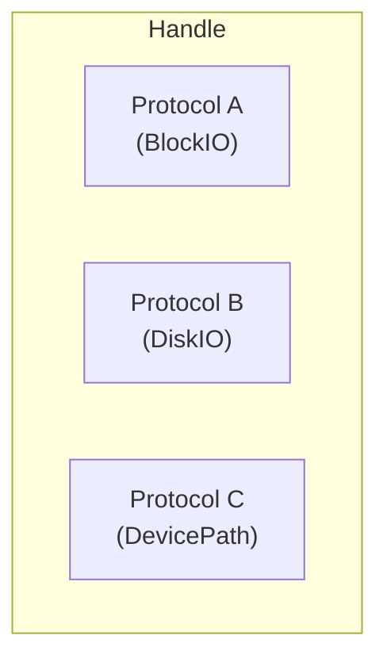

# Protocols

Working with UEFI protocols - the interface system for devices and services.

## Understanding Protocols

Protocols are UEFI's object-oriented interfaces:



Each protocol:
- Has a unique GUID identifier
- Provides a set of functions
- Is associated with handles
- Can have multiple instances (one per handle)

## Common Protocols

| Protocol | GUID | Purpose |
|----------|------|---------|
| `SimpleTextOutput` | 387477c2-... | Console output |
| `SimpleTextInput` | 387477c1-... | Console input |
| `GraphicsOutput` | 9042a9de-... | Graphics framebuffer |
| `BlockIO` | 964e5b21-... | Block device access |
| `SimpleFileSystem` | 964e5b22-... | File system access |
| `LoadedImage` | 5b1b31a1-... | Loaded image info |
| `DevicePath` | 09576e91-... | Device identification |

## Locating Protocols

### Single Instance

```rust
use uefi::proto::console::gop::GraphicsOutput;

fn find_graphics(bt: &BootServices) -> uefi::Result {
    // Find the first instance
    let gop = bt.locate_protocol::<GraphicsOutput>()?;

    log::info!("Found Graphics Output Protocol");
    log::info!("  Modes: {}", gop.modes().count());

    Ok(())
}
```

### All Instances

```rust
use uefi::proto::media::block::BlockIO;
use uefi::table::boot::SearchType;

fn find_all_disks(bt: &BootServices) -> uefi::Result {
    // Find all handles with BlockIO
    let handles = bt.locate_handle_buffer(
        SearchType::ByProtocol(&BlockIO::GUID)
    )?;

    log::info!("Found {} block devices:", handles.len());

    for (i, handle) in handles.iter().enumerate() {
        let block_io = bt.open_protocol_exclusive::<BlockIO>(*handle)?;

        let media = block_io.media();
        let size_mb = (media.last_block + 1) * media.block_size as u64 / 1024 / 1024;

        log::info!("  Device {}: {} MB, removable: {}",
            i, size_mb, media.removable_media);
    }

    Ok(())
}
```

## Opening Protocols

### Exclusive Access

```rust
fn open_exclusive(bt: &BootServices, handle: Handle) -> uefi::Result {
    // Exclusive access prevents others from using it
    let protocol = bt.open_protocol_exclusive::<BlockIO>(handle)?;

    // Protocol is automatically closed when dropped

    Ok(())
}
```

### Scoped Protocol

```rust
fn use_protocol(bt: &BootServices, handle: Handle) -> uefi::Result {
    // ScopedProtocol manages lifetime
    let block_io = bt.open_protocol_exclusive::<BlockIO>(handle)?;

    // Use the protocol
    let media = block_io.media();
    log::info!("Block size: {}", media.block_size);

    // Automatically closed here
    Ok(())
}
```

## SimpleTextOutput Protocol

Console text output:

```rust
use uefi::proto::console::text::{Output, Color};

fn text_output_demo(output: &mut Output) -> uefi::Result {
    // Clear screen
    output.clear()?;

    // Set colors
    output.set_color(Color::Yellow, Color::Blue)?;

    // Output text
    output.output_string(cstr16!("Yellow on Blue\r\n"))?;

    // Reset to default
    output.set_color(Color::LightGray, Color::Black)?;

    // Query modes
    for mode in output.modes() {
        let (cols, rows) = mode.columns();
        log::info!("Mode: {}x{}", cols, rows);
    }

    // Set a specific mode
    // output.set_mode(output.modes().next().unwrap())?;

    Ok(())
}
```

## SimpleTextInput Protocol

Keyboard input:

```rust
use uefi::proto::console::text::{Input, Key, ScanCode};

fn text_input_demo(bt: &BootServices, input: &mut Input) -> uefi::Result {
    // Reset input
    input.reset(false)?;

    log::info!("Press a key...");

    // Wait for key event
    let event = input.wait_for_key_event()?;
    bt.wait_for_event(&mut [event])?;

    // Read the key
    if let Some(key) = input.read_key()? {
        match key {
            Key::Printable(c) => {
                let ch: char = c.into();
                log::info!("Pressed: '{}'", ch);
            }
            Key::Special(scan) => {
                match scan {
                    ScanCode::ESCAPE => log::info!("Escape pressed"),
                    ScanCode::UP => log::info!("Up arrow"),
                    ScanCode::DOWN => log::info!("Down arrow"),
                    _ => log::info!("Special key: {:?}", scan),
                }
            }
        }
    }

    Ok(())
}
```

## BlockIO Protocol

Low-level block device access:

```rust
use uefi::proto::media::block::BlockIO;

fn read_blocks(bt: &BootServices) -> uefi::Result {
    let handles = bt.locate_handle_buffer(
        SearchType::ByProtocol(&BlockIO::GUID)
    )?;

    if let Some(&handle) = handles.first() {
        let block_io = bt.open_protocol_exclusive::<BlockIO>(handle)?;

        let media = block_io.media();
        let block_size = media.block_size as usize;

        // Allocate buffer for one block
        let mut buffer = alloc::vec![0u8; block_size];

        // Read first block (LBA 0)
        block_io.read_blocks(media.media_id, 0, &mut buffer)?;

        log::info!("First block (first 16 bytes):");
        log::info!("  {:02x?}", &buffer[..16]);

        // Check for MBR signature
        if buffer[510] == 0x55 && buffer[511] == 0xAA {
            log::info!("  MBR signature found!");
        }
    }

    Ok(())
}
```

## DiskIO Protocol

Higher-level disk access without block alignment:

```rust
use uefi::proto::media::disk::DiskIo;

fn read_disk(bt: &BootServices) -> uefi::Result {
    let handles = bt.locate_handle_buffer(
        SearchType::ByProtocol(&DiskIo::GUID)
    )?;

    if let Some(&handle) = handles.first() {
        let disk_io = bt.open_protocol_exclusive::<DiskIo>(handle)?;

        // Get media ID from BlockIO
        let block_io = bt.open_protocol_exclusive::<BlockIO>(handle)?;
        let media_id = block_io.media().media_id;

        // Read 512 bytes starting at offset 0
        let mut buffer = [0u8; 512];
        disk_io.read_disk(media_id, 0, &mut buffer)?;

        log::info!("Read {} bytes", buffer.len());
    }

    Ok(())
}
```

## LoadedImage Protocol

Information about loaded executables:

```rust
use uefi::proto::loaded_image::LoadedImage;

fn image_info(bt: &BootServices, image_handle: Handle) -> uefi::Result {
    let loaded_image = bt.open_protocol_exclusive::<LoadedImage>(image_handle)?;

    let (base, size) = loaded_image.info();
    log::info!("Loaded Image Info:");
    log::info!("  Base address: {:?}", base);
    log::info!("  Size: {} bytes", size);

    // Get device we were loaded from
    if let Some(device) = loaded_image.device() {
        log::info!("  Device handle: {:?}", device);
    }

    // Get file path
    if let Some(path) = loaded_image.file_path() {
        log::info!("  File path: {:?}", path);
    }

    Ok(())
}
```

## DevicePath Protocol

Device identification and hierarchy:

```rust
use uefi::proto::device_path::{DevicePath, DeviceType, DeviceSubType};
use uefi::proto::device_path::text::DevicePathToText;

fn print_device_path(bt: &BootServices, handle: Handle) -> uefi::Result {
    let device_path = bt.open_protocol_exclusive::<DevicePath>(handle)?;

    // Convert to text if protocol available
    if let Ok(to_text) = bt.locate_protocol::<DevicePathToText>() {
        let text = to_text.convert_device_path_to_text(
            &device_path,
            true,  // display only
            false, // allow shortcuts
        )?;
        log::info!("Device path: {}", text);
    }

    // Manual traversal
    for node in device_path.node_iter() {
        log::info!("  Type: {:?}, SubType: {:?}",
            node.device_type(), node.sub_type());
    }

    Ok(())
}
```

## Creating Protocol Wrappers

For cleaner code, wrap protocols:

```rust
struct Disk<'a> {
    block_io: ScopedProtocol<'a, BlockIO>,
    media_id: u32,
    block_size: u32,
    total_blocks: u64,
}

impl<'a> Disk<'a> {
    fn open(bt: &'a BootServices, handle: Handle) -> uefi::Result<Self> {
        let block_io = bt.open_protocol_exclusive::<BlockIO>(handle)?;

        let media = block_io.media();

        Ok(Disk {
            block_io,
            media_id: media.media_id,
            block_size: media.block_size,
            total_blocks: media.last_block + 1,
        })
    }

    fn read_sector(&self, lba: u64, buffer: &mut [u8]) -> uefi::Result {
        self.block_io.read_blocks(self.media_id, lba, buffer)
    }

    fn size_bytes(&self) -> u64 {
        self.total_blocks * self.block_size as u64
    }
}
```

## Protocol Registration

Creating and installing custom protocols (advanced):

```rust
use uefi::proto::Protocol;
use uefi::Guid;

// Define a custom protocol
#[repr(C)]
struct MyProtocol {
    revision: u64,
    get_value: unsafe extern "efiapi" fn() -> u32,
}

unsafe impl Protocol for MyProtocol {
    const GUID: Guid = Guid::from_values(
        0x12345678, 0x1234, 0x1234,
        [0x12, 0x34, 0x56, 0x78, 0x9a, 0xbc, 0xde, 0xf0]
    );
}

unsafe extern "efiapi" fn get_value_impl() -> u32 {
    42
}

fn install_protocol(bt: &BootServices, handle: Handle) -> uefi::Result {
    let protocol = MyProtocol {
        revision: 1,
        get_value: get_value_impl,
    };

    // Install on handle
    unsafe {
        bt.install_protocol_interface(
            Some(handle),
            &MyProtocol::GUID,
            &protocol as *const _ as *mut core::ffi::c_void,
        )?;
    }

    Ok(())
}
```

## Complete Example

```rust
#![no_main]
#![no_std]

extern crate alloc;

use uefi::prelude::*;
use uefi::proto::console::gop::GraphicsOutput;
use uefi::proto::media::block::BlockIO;
use uefi::table::boot::SearchType;

#[entry]
fn main(image: Handle, st: SystemTable<Boot>) -> Status {
    uefi::helpers::init().unwrap();

    let bt = st.boot_services();

    // Graphics Output Protocol
    log::info!("=== Graphics ===");
    if let Ok(gop) = bt.locate_protocol::<GraphicsOutput>() {
        let mode = gop.current_mode_info();
        log::info!("Resolution: {}x{}",
            mode.resolution().0,
            mode.resolution().1);
    } else {
        log::info!("No graphics available");
    }

    // Block devices
    log::info!("\n=== Block Devices ===");
    if let Ok(handles) = bt.locate_handle_buffer(SearchType::ByProtocol(&BlockIO::GUID)) {
        for (i, &handle) in handles.iter().enumerate().take(5) {
            if let Ok(block_io) = bt.open_protocol_exclusive::<BlockIO>(handle) {
                let media = block_io.media();
                let size = (media.last_block + 1) * media.block_size as u64;
                log::info!("Device {}: {} bytes, block_size: {}",
                    i, size, media.block_size);
            }
        }
    }

    Status::SUCCESS
}
```

## Summary

| Protocol | Purpose |
|----------|---------|
| `SimpleTextOutput` | Console text display |
| `SimpleTextInput` | Keyboard input |
| `GraphicsOutput` | Framebuffer access |
| `BlockIO` | Block device I/O |
| `DiskIO` | Unaligned disk I/O |
| `LoadedImage` | Executable information |
| `DevicePath` | Device identification |

## Next Steps

Learn about [File System]() access using UEFI protocols.
