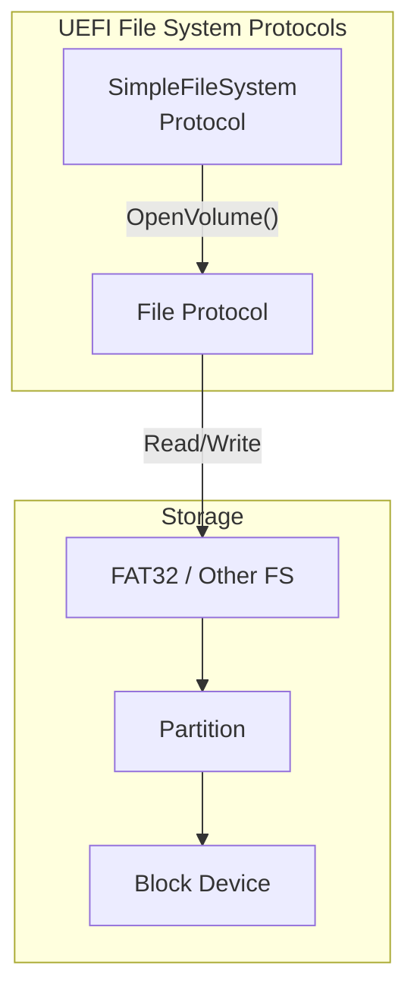

# File System

Accessing files and directories using UEFI file system protocols.

## File System Architecture



## SimpleFileSystem Protocol

The entry point for file access:

```rust
use uefi::proto::media::fs::SimpleFileSystem;
use uefi::proto::media::file::{File, FileMode, FileAttribute, Directory};
use uefi::table::boot::SearchType;

fn open_filesystem(bt: &BootServices) -> uefi::Result<Directory> {
    // Find all file system handles
    let handles = bt.locate_handle_buffer(
        SearchType::ByProtocol(&SimpleFileSystem::GUID)
    )?;

    log::info!("Found {} file systems", handles.len());

    // Open first file system
    if let Some(&handle) = handles.first() {
        let fs = bt.open_protocol_exclusive::<SimpleFileSystem>(handle)?;

        // Open the root directory
        let root = fs.open_volume()?;

        log::info!("Opened root directory");
        return Ok(root);
    }

    Err(uefi::Status::NOT_FOUND.into())
}
```

## Opening Files

### Read a File

```rust
use uefi::proto::media::file::{File, FileMode, FileAttribute, RegularFile};
use uefi::CStr16;

fn read_file(root: &mut Directory, path: &CStr16) -> uefi::Result<alloc::vec::Vec<u8>> {
    // Open file for reading
    let handle = root.open(
        path,
        FileMode::Read,
        FileAttribute::empty(),
    )?;

    // Convert to regular file
    let mut file = handle.into_regular_file().ok_or(uefi::Status::INVALID_PARAMETER)?;

    // Get file size
    let mut info_buffer = [0u8; 256];
    let info = file.get_info::<FileInfo>(&mut info_buffer)?;
    let size = info.file_size() as usize;

    log::info!("File size: {} bytes", size);

    // Read file contents
    let mut buffer = alloc::vec![0u8; size];
    let bytes_read = file.read(&mut buffer)?;
    buffer.truncate(bytes_read);

    log::info!("Read {} bytes", bytes_read);

    Ok(buffer)
}
```

### Write a File

```rust
fn write_file(root: &mut Directory, path: &CStr16, data: &[u8]) -> uefi::Result {
    // Open or create file for writing
    let handle = root.open(
        path,
        FileMode::CreateReadWrite,
        FileAttribute::empty(),
    )?;

    let mut file = handle.into_regular_file().ok_or(uefi::Status::INVALID_PARAMETER)?;

    // Write data
    file.write(data)?;

    // Flush to ensure data is written
    file.flush()?;

    log::info!("Wrote {} bytes to file", data.len());

    Ok(())
}
```

### Create a New File

```rust
fn create_file(root: &mut Directory, name: &CStr16) -> uefi::Result<RegularFile> {
    let handle = root.open(
        name,
        FileMode::CreateReadWrite,
        FileAttribute::empty(),
    )?;

    let file = handle.into_regular_file().ok_or(uefi::Status::INVALID_PARAMETER)?;

    log::info!("Created file");

    Ok(file)
}
```

## Directory Operations

### List Directory Contents

```rust
use uefi::proto::media::file::FileInfo;

fn list_directory(dir: &mut Directory) -> uefi::Result {
    // Reset to beginning
    dir.reset_entry_readout()?;

    log::info!("Directory contents:");

    loop {
        // Buffer for file info
        let mut buffer = [0u8; 512];

        match dir.read_entry(&mut buffer) {
            Ok(Some(info)) => {
                let name = info.file_name();
                let size = info.file_size();
                let is_dir = info.attribute().contains(FileAttribute::DIRECTORY);

                if is_dir {
                    log::info!("  [DIR]  {}", name);
                } else {
                    log::info!("  {:>8} bytes  {}", size, name);
                }
            }
            Ok(None) => break, // End of directory
            Err(e) => return Err(e),
        }
    }

    Ok(())
}
```

### Create Directory

```rust
fn create_directory(root: &mut Directory, name: &CStr16) -> uefi::Result<Directory> {
    let handle = root.open(
        name,
        FileMode::CreateReadWrite,
        FileAttribute::DIRECTORY,
    )?;

    let dir = handle.into_directory().ok_or(uefi::Status::INVALID_PARAMETER)?;

    log::info!("Created directory");

    Ok(dir)
}
```

### Open Subdirectory

```rust
fn open_subdirectory(parent: &mut Directory, name: &CStr16) -> uefi::Result<Directory> {
    let handle = parent.open(
        name,
        FileMode::Read,
        FileAttribute::empty(),
    )?;

    let dir = handle.into_directory().ok_or(uefi::Status::NOT_A_DIRECTORY)?;

    Ok(dir)
}
```

## File Information

### Get File Info

```rust
use uefi::proto::media::file::{FileInfo, FileSystemInfo};

fn get_file_info(file: &mut RegularFile) -> uefi::Result {
    let mut buffer = [0u8; 512];
    let info = file.get_info::<FileInfo>(&mut buffer)?;

    log::info!("File Information:");
    log::info!("  Name: {}", info.file_name());
    log::info!("  Size: {} bytes", info.file_size());
    log::info!("  Physical Size: {} bytes", info.physical_size());
    log::info!("  Read-only: {}", info.attribute().contains(FileAttribute::READ_ONLY));
    log::info!("  Hidden: {}", info.attribute().contains(FileAttribute::HIDDEN));
    log::info!("  System: {}", info.attribute().contains(FileAttribute::SYSTEM));

    Ok(())
}
```

### Get File System Info

```rust
fn get_fs_info(root: &mut Directory) -> uefi::Result {
    let mut buffer = [0u8; 512];
    let info = root.get_info::<FileSystemInfo>(&mut buffer)?;

    log::info!("File System Information:");
    log::info!("  Volume Label: {}", info.volume_label());
    log::info!("  Volume Size: {} bytes", info.volume_size());
    log::info!("  Free Space: {} bytes", info.free_space());
    log::info!("  Block Size: {} bytes", info.block_size());
    log::info!("  Read-only: {}", info.read_only());

    Ok(())
}
```

### Set File Info

```rust
fn set_file_readonly(file: &mut RegularFile, readonly: bool) -> uefi::Result {
    let mut buffer = [0u8; 512];
    let info = file.get_info::<FileInfo>(&mut buffer)?;

    // Modify attributes
    let mut attr = info.attribute();
    if readonly {
        attr |= FileAttribute::READ_ONLY;
    } else {
        attr -= FileAttribute::READ_ONLY;
    }

    // Create new info with modified attributes
    // Note: This requires creating a new FileInfo structure
    // The actual API may vary

    Ok(())
}
```

## File Positioning

```rust
fn file_seek_example(file: &mut RegularFile) -> uefi::Result {
    // Get current position
    let pos = file.get_position()?;
    log::info!("Current position: {}", pos);

    // Seek to beginning
    file.set_position(0)?;

    // Seek to end (use special value)
    file.set_position(u64::MAX)?;
    let size = file.get_position()?;
    log::info!("File size: {}", size);

    // Seek to middle
    file.set_position(size / 2)?;

    Ok(())
}
```

## Delete Files

```rust
fn delete_file(root: &mut Directory, path: &CStr16) -> uefi::Result {
    let handle = root.open(
        path,
        FileMode::Read,  // Open existing
        FileAttribute::empty(),
    )?;

    // Delete the file
    handle.delete()?;

    log::info!("File deleted");

    Ok(())
}
```

## Finding the Boot Volume

```rust
use uefi::proto::loaded_image::LoadedImage;
use uefi::proto::media::fs::SimpleFileSystem;

fn get_boot_volume(bt: &BootServices, image: Handle) -> uefi::Result<Directory> {
    // Get the loaded image protocol
    let loaded_image = bt.open_protocol_exclusive::<LoadedImage>(image)?;

    // Get the device handle we were loaded from
    let device = loaded_image.device().ok_or(uefi::Status::NOT_FOUND)?;

    // Open the file system on that device
    let fs = bt.open_protocol_exclusive::<SimpleFileSystem>(device)?;

    // Open root directory
    let root = fs.open_volume()?;

    log::info!("Opened boot volume");

    Ok(root)
}
```

## Complete Example

```rust
#![no_main]
#![no_std]

extern crate alloc;

use alloc::vec::Vec;
use uefi::prelude::*;
use uefi::proto::media::fs::SimpleFileSystem;
use uefi::proto::media::file::{File, FileMode, FileAttribute, FileInfo};
use uefi::table::boot::SearchType;
use uefi::CStr16;

#[entry]
fn main(image: Handle, st: SystemTable<Boot>) -> Status {
    uefi::helpers::init().unwrap();

    let bt = st.boot_services();

    // Find file systems
    let handles = match bt.locate_handle_buffer(SearchType::ByProtocol(&SimpleFileSystem::GUID)) {
        Ok(h) => h,
        Err(_) => {
            log::error!("No file systems found");
            return Status::NOT_FOUND;
        }
    };

    log::info!("Found {} file systems", handles.len());

    // Open first file system
    if let Some(&handle) = handles.first() {
        let fs = bt.open_protocol_exclusive::<SimpleFileSystem>(handle).unwrap();
        let mut root = fs.open_volume().unwrap();

        // List root directory
        log::info!("\n=== Root Directory ===");
        root.reset_entry_readout().unwrap();

        let mut count = 0;
        loop {
            let mut buffer = [0u8; 512];
            match root.read_entry(&mut buffer) {
                Ok(Some(info)) => {
                    let name = info.file_name();
                    let is_dir = info.attribute().contains(FileAttribute::DIRECTORY);
                    if is_dir {
                        log::info!("[DIR]  {}", name);
                    } else {
                        log::info!("{:>8}  {}", info.file_size(), name);
                    }
                    count += 1;
                }
                Ok(None) => break,
                Err(_) => break,
            }
        }
        log::info!("\nTotal: {} entries", count);

        // Try to read a specific file
        log::info!("\n=== Reading File ===");
        let path = cstr16!("\\EFI\\BOOT\\BOOTX64.EFI");

        match root.open(path, FileMode::Read, FileAttribute::empty()) {
            Ok(handle) => {
                if let Some(mut file) = handle.into_regular_file() {
                    let mut info_buf = [0u8; 256];
                    if let Ok(info) = file.get_info::<FileInfo>(&mut info_buf) {
                        log::info!("Found: {}", info.file_name());
                        log::info!("Size: {} bytes", info.file_size());
                    }
                }
            }
            Err(_) => log::info!("File not found"),
        }
    }

    Status::SUCCESS
}
```

## Error Handling

| Status | Meaning |
|--------|---------|
| `NOT_FOUND` | File or directory doesn't exist |
| `ACCESS_DENIED` | Permission denied |
| `VOLUME_FULL` | No space left |
| `WRITE_PROTECTED` | Read-only media |
| `MEDIA_CHANGED` | Media was removed/changed |

## Summary

| Operation | Method |
|-----------|--------|
| Open volume | `SimpleFileSystem::open_volume()` |
| Open file | `Directory::open()` |
| Read file | `RegularFile::read()` |
| Write file | `RegularFile::write()` |
| List directory | `Directory::read_entry()` |
| Get info | `File::get_info()` |
| Delete | `FileHandle::delete()` |

## See Also

- [Example Code](https://github.com/MichaelTien8901/rust-guide-tutorial/tree/master/examples/part7/uefi-filesystem)

## Next Steps

Learn about [Graphics]() output using the Graphics Output Protocol.
