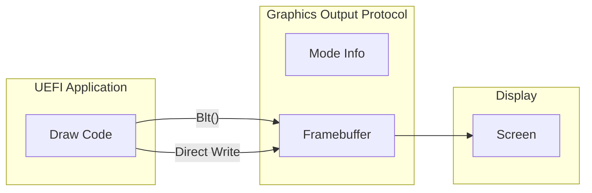

# Graphics

Working with the Graphics Output Protocol (GOP) for display output.

## Graphics Output Protocol

GOP provides access to the display framebuffer:



## Finding GOP

```rust
use uefi::proto::console::gop::{GraphicsOutput, PixelFormat};

fn find_gop(bt: &BootServices) -> uefi::Result<&mut GraphicsOutput> {
    let gop = bt.locate_protocol::<GraphicsOutput>()?;

    let mode = gop.current_mode_info();
    log::info!("Current mode: {}x{}",
        mode.resolution().0,
        mode.resolution().1);

    Ok(gop)
}
```

## Querying Display Modes

```rust
fn list_modes(gop: &GraphicsOutput) {
    log::info!("Available graphics modes:");

    for (i, mode) in gop.modes(bt).enumerate() {
        let info = mode.info();
        let (width, height) = info.resolution();
        let format = info.pixel_format();

        log::info!("  Mode {}: {}x{} {:?}",
            i, width, height, format);
    }
}
```

## Setting Display Mode

```rust
fn set_mode(gop: &mut GraphicsOutput, bt: &BootServices, index: usize) -> uefi::Result {
    let modes: alloc::vec::Vec<_> = gop.modes(bt).collect();

    if index >= modes.len() {
        return Err(uefi::Status::INVALID_PARAMETER.into());
    }

    gop.set_mode(&modes[index])?;

    let info = gop.current_mode_info();
    log::info!("Set mode to {}x{}",
        info.resolution().0,
        info.resolution().1);

    Ok(())
}

fn find_best_mode(gop: &mut GraphicsOutput, bt: &BootServices) -> uefi::Result {
    // Find the highest resolution mode
    let mut best_mode = None;
    let mut best_pixels = 0u64;

    for mode in gop.modes(bt) {
        let info = mode.info();
        let (w, h) = info.resolution();
        let pixels = w as u64 * h as u64;

        if pixels > best_pixels {
            best_pixels = pixels;
            best_mode = Some(mode);
        }
    }

    if let Some(mode) = best_mode {
        gop.set_mode(&mode)?;
        log::info!("Selected best mode");
    }

    Ok(())
}
```

## Pixel Formats

| Format | Description | Byte Order |
|--------|-------------|------------|
| `Rgb` | 32-bit RGB | R, G, B, Reserved |
| `Bgr` | 32-bit BGR | B, G, R, Reserved |
| `Bitmask` | Custom masks | Defined by mode |
| `BltOnly` | No direct access | Use Blt only |

```rust
fn get_pixel_info(gop: &GraphicsOutput) {
    let mode = gop.current_mode_info();

    match mode.pixel_format() {
        PixelFormat::Rgb => log::info!("Format: RGB (32-bit)"),
        PixelFormat::Bgr => log::info!("Format: BGR (32-bit)"),
        PixelFormat::Bitmask => {
            let mask = mode.pixel_bitmask().unwrap();
            log::info!("Format: Bitmask");
            log::info!("  Red:   {:#010x}", mask.red);
            log::info!("  Green: {:#010x}", mask.green);
            log::info!("  Blue:  {:#010x}", mask.blue);
        }
        PixelFormat::BltOnly => log::info!("Format: BltOnly (no direct access)"),
    }
}
```

## Direct Framebuffer Access

```rust
use uefi::proto::console::gop::BltPixel;

fn direct_framebuffer_access(gop: &mut GraphicsOutput) -> uefi::Result {
    let mode = gop.current_mode_info();
    let (width, height) = mode.resolution();
    let stride = mode.stride();

    // Get framebuffer
    let mut fb = gop.frame_buffer();
    let fb_ptr = fb.as_mut_ptr() as *mut u32;

    // Clear screen to blue (assuming BGR format)
    let blue: u32 = 0x00FF0000; // BGR: Blue

    for y in 0..height {
        for x in 0..width {
            let offset = y * stride + x;
            unsafe {
                fb_ptr.add(offset).write_volatile(blue);
            }
        }
    }

    Ok(())
}
```

## Drawing Primitives

### Set Pixel

```rust
fn set_pixel(gop: &mut GraphicsOutput, x: usize, y: usize, color: u32) {
    let mode = gop.current_mode_info();
    let stride = mode.stride();

    let mut fb = gop.frame_buffer();
    let fb_ptr = fb.as_mut_ptr() as *mut u32;

    let offset = y * stride + x;
    unsafe {
        fb_ptr.add(offset).write_volatile(color);
    }
}
```

### Draw Rectangle

```rust
fn draw_rect(
    gop: &mut GraphicsOutput,
    x: usize, y: usize,
    width: usize, height: usize,
    color: u32,
) {
    let mode = gop.current_mode_info();
    let stride = mode.stride();

    let mut fb = gop.frame_buffer();
    let fb_ptr = fb.as_mut_ptr() as *mut u32;

    for row in y..(y + height) {
        for col in x..(x + width) {
            let offset = row * stride + col;
            unsafe {
                fb_ptr.add(offset).write_volatile(color);
            }
        }
    }
}
```

### Draw Line (Bresenham)

```rust
fn draw_line(
    gop: &mut GraphicsOutput,
    x0: i32, y0: i32,
    x1: i32, y1: i32,
    color: u32,
) {
    let dx = (x1 - x0).abs();
    let dy = -(y1 - y0).abs();
    let sx = if x0 < x1 { 1 } else { -1 };
    let sy = if y0 < y1 { 1 } else { -1 };
    let mut err = dx + dy;

    let mut x = x0;
    let mut y = y0;

    loop {
        set_pixel(gop, x as usize, y as usize, color);

        if x == x1 && y == y1 {
            break;
        }

        let e2 = 2 * err;
        if e2 >= dy {
            err += dy;
            x += sx;
        }
        if e2 <= dx {
            err += dx;
            y += sy;
        }
    }
}
```

## Using Blt Operations

Blt (Block Transfer) operations are faster and work with all pixel formats:

### Fill Rectangle with Blt

```rust
use uefi::proto::console::gop::{BltOp, BltPixel, BltRegion};

fn blt_fill_rect(
    gop: &mut GraphicsOutput,
    x: usize, y: usize,
    width: usize, height: usize,
    color: BltPixel,
) -> uefi::Result {
    gop.blt(BltOp::VideoFill {
        color,
        dest: (x, y),
        dims: (width, height),
    })
}

fn clear_screen(gop: &mut GraphicsOutput, color: BltPixel) -> uefi::Result {
    let mode = gop.current_mode_info();
    let (width, height) = mode.resolution();

    blt_fill_rect(gop, 0, 0, width, height, color)
}
```

### Copy from Buffer to Screen

```rust
fn blt_buffer_to_video(
    gop: &mut GraphicsOutput,
    buffer: &[BltPixel],
    src_width: usize,
    dest_x: usize, dest_y: usize,
    width: usize, height: usize,
) -> uefi::Result {
    gop.blt(BltOp::BufferToVideo {
        buffer,
        src: BltRegion::SubRectangle {
            coords: (0, 0),
            px_stride: src_width,
        },
        dest: (dest_x, dest_y),
        dims: (width, height),
    })
}
```

### Copy Screen Region

```rust
fn blt_copy_region(
    gop: &mut GraphicsOutput,
    src_x: usize, src_y: usize,
    dest_x: usize, dest_y: usize,
    width: usize, height: usize,
) -> uefi::Result {
    gop.blt(BltOp::VideoToVideo {
        src: (src_x, src_y),
        dest: (dest_x, dest_y),
        dims: (width, height),
    })
}
```

## Double Buffering

```rust
struct DoubleBuffer {
    buffer: alloc::vec::Vec<BltPixel>,
    width: usize,
    height: usize,
}

impl DoubleBuffer {
    fn new(width: usize, height: usize) -> Self {
        let buffer = alloc::vec![BltPixel::new(0, 0, 0); width * height];
        DoubleBuffer { buffer, width, height }
    }

    fn clear(&mut self, color: BltPixel) {
        self.buffer.fill(color);
    }

    fn set_pixel(&mut self, x: usize, y: usize, color: BltPixel) {
        if x < self.width && y < self.height {
            self.buffer[y * self.width + x] = color;
        }
    }

    fn present(&self, gop: &mut GraphicsOutput) -> uefi::Result {
        gop.blt(BltOp::BufferToVideo {
            buffer: &self.buffer,
            src: BltRegion::Full,
            dest: (0, 0),
            dims: (self.width, self.height),
        })
    }
}
```

## Color Helpers

```rust
fn rgb(r: u8, g: u8, b: u8) -> BltPixel {
    BltPixel::new(r, g, b)
}

// Common colors
const BLACK: BltPixel = BltPixel::new(0, 0, 0);
const WHITE: BltPixel = BltPixel::new(255, 255, 255);
const RED: BltPixel = BltPixel::new(255, 0, 0);
const GREEN: BltPixel = BltPixel::new(0, 255, 0);
const BLUE: BltPixel = BltPixel::new(0, 0, 255);
const YELLOW: BltPixel = BltPixel::new(255, 255, 0);
const CYAN: BltPixel = BltPixel::new(0, 255, 255);
const MAGENTA: BltPixel = BltPixel::new(255, 0, 255);
```

## Complete Example

```rust
#![no_main]
#![no_std]

extern crate alloc;

use uefi::prelude::*;
use uefi::proto::console::gop::{GraphicsOutput, BltOp, BltPixel};

#[entry]
fn main(_image: Handle, st: SystemTable<Boot>) -> Status {
    uefi::helpers::init().unwrap();

    let bt = st.boot_services();

    // Find GOP
    let gop = match bt.locate_protocol::<GraphicsOutput>() {
        Ok(g) => g,
        Err(_) => {
            log::error!("No graphics output found");
            return Status::NOT_FOUND;
        }
    };

    // Get current mode info
    let mode = gop.current_mode_info();
    let (width, height) = mode.resolution();
    log::info!("Resolution: {}x{}", width, height);

    // Clear screen to dark blue
    let dark_blue = BltPixel::new(0, 0, 64);
    gop.blt(BltOp::VideoFill {
        color: dark_blue,
        dest: (0, 0),
        dims: (width, height),
    }).unwrap();

    // Draw some colored rectangles
    let colors = [
        BltPixel::new(255, 0, 0),    // Red
        BltPixel::new(0, 255, 0),    // Green
        BltPixel::new(0, 0, 255),    // Blue
        BltPixel::new(255, 255, 0),  // Yellow
    ];

    let rect_width = width / 6;
    let rect_height = height / 4;
    let margin = 20;

    for (i, color) in colors.iter().enumerate() {
        let x = margin + i * (rect_width + margin);
        let y = height / 2 - rect_height / 2;

        gop.blt(BltOp::VideoFill {
            color: *color,
            dest: (x, y),
            dims: (rect_width, rect_height),
        }).unwrap();
    }

    // Draw a white border
    let white = BltPixel::new(255, 255, 255);
    let border = 5;

    // Top border
    gop.blt(BltOp::VideoFill {
        color: white,
        dest: (0, 0),
        dims: (width, border),
    }).unwrap();

    // Bottom border
    gop.blt(BltOp::VideoFill {
        color: white,
        dest: (0, height - border),
        dims: (width, border),
    }).unwrap();

    // Left border
    gop.blt(BltOp::VideoFill {
        color: white,
        dest: (0, 0),
        dims: (border, height),
    }).unwrap();

    // Right border
    gop.blt(BltOp::VideoFill {
        color: white,
        dest: (width - border, 0),
        dims: (border, height),
    }).unwrap();

    log::info!("Graphics demo complete!");

    // Wait for key press
    st.stdin().reset(false).unwrap();
    bt.wait_for_event(&mut [st.stdin().wait_for_key_event().unwrap()]).unwrap();

    Status::SUCCESS
}
```

## Summary

| Operation | Method |
|-----------|--------|
| Find GOP | `locate_protocol::<GraphicsOutput>()` |
| Query modes | `gop.modes()` |
| Set mode | `gop.set_mode()` |
| Get framebuffer | `gop.frame_buffer()` |
| Fill rectangle | `gop.blt(VideoFill)` |
| Draw buffer | `gop.blt(BufferToVideo)` |
| Copy region | `gop.blt(VideoToVideo)` |

## See Also

- [Example Code](https://github.com/MichaelTien8901/rust-guide-tutorial/tree/main/examples/part7/uefi-graphics)

## Next Steps

Learn about [UEFI Variables]() for persistent storage.
