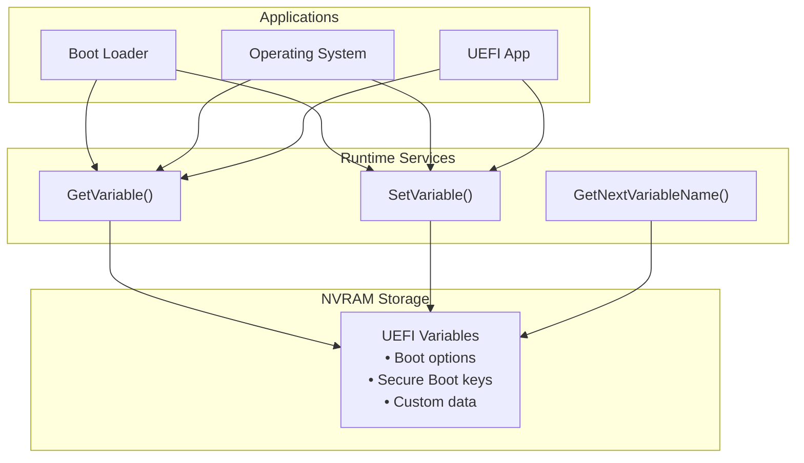

# UEFI Variables

Persistent storage using UEFI runtime variables.

## UEFI Variable System



## Variable Concepts

| Property | Description |
|----------|-------------|
| Name | UTF-16 string identifier |
| GUID | Vendor namespace (prevents collisions) |
| Attributes | Access permissions and persistence |
| Data | Arbitrary byte array |

### Common Vendor GUIDs

| GUID | Purpose |
|------|---------|
| `EFI_GLOBAL_VARIABLE` | Standard UEFI variables |
| Custom GUID | Your application's variables |

### Variable Attributes

| Attribute | Meaning |
|-----------|---------|
| `NON_VOLATILE` | Survives reboot |
| `BOOTSERVICE_ACCESS` | Available during boot |
| `RUNTIME_ACCESS` | Available to OS |

## Reading Variables

### Get a Variable

```rust
use uefi::runtime::{self, VariableVendor, VariableAttributes};
use uefi::CStr16;

fn read_variable(name: &CStr16, vendor: &VariableVendor) -> uefi::Result<alloc::vec::Vec<u8>> {
    // First, get the size
    let size = runtime::get_variable_size(name, vendor)?;

    log::info!("Variable size: {} bytes", size);

    // Allocate buffer and read
    let mut buffer = alloc::vec![0u8; size];
    let (data, attributes) = runtime::get_variable(name, vendor, &mut buffer)?;

    log::info!("Attributes: {:?}", attributes);

    Ok(data.to_vec())
}
```

### Read Standard Variables

```rust
fn read_boot_order() -> uefi::Result {
    let name = cstr16!("BootOrder");
    let vendor = VariableVendor::GLOBAL_VARIABLE;

    let mut buffer = [0u8; 256];

    match runtime::get_variable(name, &vendor, &mut buffer) {
        Ok((data, _attr)) => {
            // BootOrder is an array of u16 boot option numbers
            log::info!("Boot Order:");
            for chunk in data.chunks(2) {
                if chunk.len() == 2 {
                    let num = u16::from_le_bytes([chunk[0], chunk[1]]);
                    log::info!("  Boot{:04X}", num);
                }
            }
        }
        Err(e) => log::error!("Failed to read BootOrder: {:?}", e),
    }

    Ok(())
}

fn read_secure_boot_state() -> uefi::Result {
    let name = cstr16!("SecureBoot");
    let vendor = VariableVendor::GLOBAL_VARIABLE;

    let mut buffer = [0u8; 4];

    match runtime::get_variable(name, &vendor, &mut buffer) {
        Ok((data, _)) => {
            let enabled = data.first().map(|&b| b != 0).unwrap_or(false);
            log::info!("Secure Boot: {}", if enabled { "Enabled" } else { "Disabled" });
        }
        Err(_) => log::info!("Secure Boot variable not found"),
    }

    Ok(())
}
```

## Writing Variables

### Set a Variable

```rust
fn write_variable(
    name: &CStr16,
    vendor: &VariableVendor,
    data: &[u8],
    non_volatile: bool,
) -> uefi::Result {
    let mut attributes = VariableAttributes::BOOTSERVICE_ACCESS
        | VariableAttributes::RUNTIME_ACCESS;

    if non_volatile {
        attributes |= VariableAttributes::NON_VOLATILE;
    }

    runtime::set_variable(name, vendor, attributes, data)?;

    log::info!("Variable written successfully");

    Ok(())
}
```

### Create Custom Variable

```rust
use uefi::Guid;

// Define your own vendor GUID
const MY_VENDOR_GUID: Guid = Guid::from_values(
    0x12345678,
    0xabcd,
    0xef01,
    [0x23, 0x45, 0x67, 0x89, 0xab, 0xcd, 0xef, 0x01],
);

fn save_config(config_data: &[u8]) -> uefi::Result {
    let name = cstr16!("MyAppConfig");
    let vendor = VariableVendor(MY_VENDOR_GUID);

    let attributes = VariableAttributes::NON_VOLATILE
        | VariableAttributes::BOOTSERVICE_ACCESS
        | VariableAttributes::RUNTIME_ACCESS;

    runtime::set_variable(name, &vendor, attributes, config_data)?;

    log::info!("Configuration saved");

    Ok(())
}

fn load_config() -> uefi::Result<alloc::vec::Vec<u8>> {
    let name = cstr16!("MyAppConfig");
    let vendor = VariableVendor(MY_VENDOR_GUID);

    let size = runtime::get_variable_size(name, &vendor)?;
    let mut buffer = alloc::vec![0u8; size];

    let (data, _) = runtime::get_variable(name, &vendor, &mut buffer)?;

    log::info!("Configuration loaded: {} bytes", data.len());

    Ok(data.to_vec())
}
```

## Deleting Variables

```rust
fn delete_variable(name: &CStr16, vendor: &VariableVendor) -> uefi::Result {
    // Set with empty data and no attributes to delete
    runtime::set_variable(
        name,
        vendor,
        VariableAttributes::empty(),
        &[],
    )?;

    log::info!("Variable deleted");

    Ok(())
}
```

## Enumerating Variables

### List All Variables

```rust
fn list_all_variables() -> uefi::Result {
    log::info!("All UEFI Variables:");

    // Start with empty name
    let mut name_buf = [0u16; 256];
    let mut name = CStr16::from_u16_with_nul(&name_buf[..1]).unwrap();
    let mut vendor = VariableVendor::GLOBAL_VARIABLE;

    loop {
        match runtime::get_next_variable_name(&mut name_buf, &mut vendor) {
            Ok(next_name) => {
                name = next_name;
                log::info!("  {} ({:?})", name, vendor.0);
            }
            Err(uefi::Status::NOT_FOUND) => break, // End of list
            Err(e) => return Err(e.into()),
        }
    }

    Ok(())
}
```

### Find Variables by Vendor

```rust
fn list_global_variables() -> uefi::Result {
    log::info!("Global UEFI Variables:");

    let mut name_buf = [0u16; 256];
    let mut vendor = VariableVendor::GLOBAL_VARIABLE;
    let global_guid = VariableVendor::GLOBAL_VARIABLE.0;

    // Initialize with empty string
    name_buf[0] = 0;

    loop {
        match runtime::get_next_variable_name(&mut name_buf, &mut vendor) {
            Ok(name) => {
                // Only show global variables
                if vendor.0 == global_guid {
                    log::info!("  {}", name);
                }
            }
            Err(uefi::Status::NOT_FOUND) => break,
            Err(e) => return Err(e.into()),
        }
    }

    Ok(())
}
```

## Structured Data Storage

### Save a Struct

```rust
#[repr(C, packed)]
struct AppSettings {
    version: u32,
    timeout: u32,
    flags: u32,
}

fn save_settings(settings: &AppSettings) -> uefi::Result {
    let name = cstr16!("Settings");
    let vendor = VariableVendor(MY_VENDOR_GUID);

    // Convert struct to bytes
    let data = unsafe {
        core::slice::from_raw_parts(
            settings as *const _ as *const u8,
            core::mem::size_of::<AppSettings>(),
        )
    };

    let attributes = VariableAttributes::NON_VOLATILE
        | VariableAttributes::BOOTSERVICE_ACCESS;

    runtime::set_variable(name, &vendor, attributes, data)?;

    Ok(())
}

fn load_settings() -> uefi::Result<AppSettings> {
    let name = cstr16!("Settings");
    let vendor = VariableVendor(MY_VENDOR_GUID);

    let mut buffer = [0u8; core::mem::size_of::<AppSettings>()];
    let (data, _) = runtime::get_variable(name, &vendor, &mut buffer)?;

    if data.len() != core::mem::size_of::<AppSettings>() {
        return Err(uefi::Status::BUFFER_TOO_SMALL.into());
    }

    // Convert bytes to struct
    let settings = unsafe {
        core::ptr::read_unaligned(data.as_ptr() as *const AppSettings)
    };

    Ok(settings)
}
```

## Variable Size Limits

```rust
fn check_variable_storage() -> uefi::Result {
    // Query storage info
    let info = runtime::query_variable_info(
        VariableAttributes::NON_VOLATILE
            | VariableAttributes::BOOTSERVICE_ACCESS
            | VariableAttributes::RUNTIME_ACCESS,
    )?;

    log::info!("Variable Storage Info:");
    log::info!("  Max variable storage: {} bytes", info.maximum_variable_storage_size);
    log::info!("  Remaining storage: {} bytes", info.remaining_variable_storage_size);
    log::info!("  Max variable size: {} bytes", info.maximum_variable_size);

    Ok(())
}
```

## Complete Example

```rust
#![no_main]
#![no_std]

extern crate alloc;

use alloc::vec::Vec;
use uefi::prelude::*;
use uefi::runtime::{self, VariableVendor, VariableAttributes};
use uefi::Guid;

const APP_GUID: Guid = Guid::from_values(
    0xdeadbeef, 0xcafe, 0xbabe,
    [0x12, 0x34, 0x56, 0x78, 0x9a, 0xbc, 0xde, 0xf0],
);

#[entry]
fn main(_image: Handle, st: SystemTable<Boot>) -> Status {
    uefi::helpers::init().unwrap();

    log::info!("=== UEFI Variables Demo ===\n");

    // Read some standard variables
    log::info!("--- Standard Variables ---");

    // SecureBoot
    let mut buf = [0u8; 4];
    if let Ok((data, _)) = runtime::get_variable(
        cstr16!("SecureBoot"),
        &VariableVendor::GLOBAL_VARIABLE,
        &mut buf,
    ) {
        let enabled = data.first().map(|&b| b != 0).unwrap_or(false);
        log::info!("Secure Boot: {}", if enabled { "Enabled" } else { "Disabled" });
    }

    // Create custom variable
    log::info!("\n--- Custom Variable ---");

    let vendor = VariableVendor(APP_GUID);
    let var_name = cstr16!("DemoCounter");

    // Try to read existing counter
    let mut counter: u32 = 0;
    let mut buf = [0u8; 4];

    if let Ok((data, _)) = runtime::get_variable(var_name, &vendor, &mut buf) {
        if data.len() >= 4 {
            counter = u32::from_le_bytes([data[0], data[1], data[2], data[3]]);
            log::info!("Existing counter: {}", counter);
        }
    } else {
        log::info!("Counter not found, creating new");
    }

    // Increment and save
    counter += 1;
    let counter_bytes = counter.to_le_bytes();

    let attributes = VariableAttributes::NON_VOLATILE
        | VariableAttributes::BOOTSERVICE_ACCESS
        | VariableAttributes::RUNTIME_ACCESS;

    match runtime::set_variable(var_name, &vendor, attributes, &counter_bytes) {
        Ok(_) => log::info!("Counter saved: {}", counter),
        Err(e) => log::error!("Failed to save: {:?}", e),
    }

    // Query storage info
    log::info!("\n--- Storage Info ---");
    if let Ok(info) = runtime::query_variable_info(attributes) {
        log::info!("Max storage: {} KB", info.maximum_variable_storage_size / 1024);
        log::info!("Remaining: {} KB", info.remaining_variable_storage_size / 1024);
        log::info!("Max variable: {} bytes", info.maximum_variable_size);
    }

    Status::SUCCESS
}
```

## Best Practices

1. **Use your own GUID** for custom variables to avoid conflicts
2. **Check storage space** before writing large variables
3. **Handle errors** gracefully (variable might not exist)
4. **Use NON_VOLATILE** only when persistence is needed
5. **Include RUNTIME_ACCESS** if OS needs access
6. **Version your data** structures for forward compatibility

## Summary

| Operation | Function |
|-----------|----------|
| Read | `get_variable()` |
| Write | `set_variable()` |
| Delete | `set_variable()` with empty data |
| Enumerate | `get_next_variable_name()` |
| Check size | `get_variable_size()` |
| Query storage | `query_variable_info()` |

## Next Steps

Learn about [QEMU Testing]() for debugging UEFI applications.
