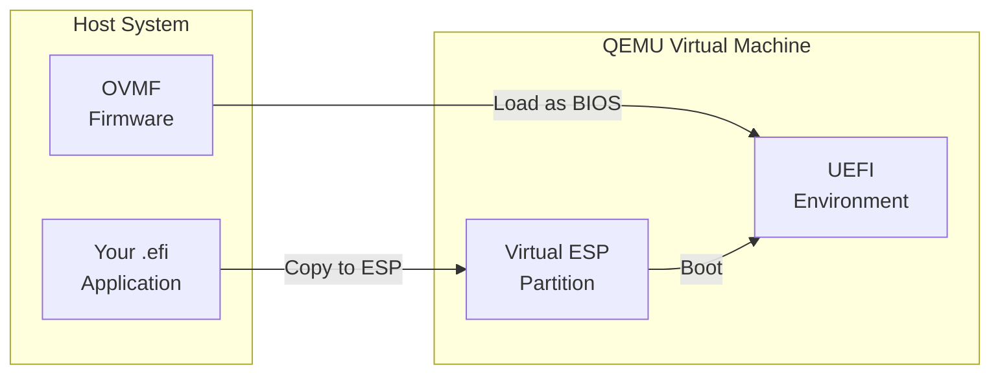

# QEMU Testing

Testing and debugging UEFI applications with QEMU and OVMF.

## QEMU and OVMF Setup



## Installing OVMF

### Ubuntu/Debian

```bash
sudo apt install ovmf qemu-system-x86

# Verify installation
ls /usr/share/OVMF/
# OVMF_CODE.fd - Firmware code
# OVMF_VARS.fd - Variable storage template
```

### Fedora

```bash
sudo dnf install edk2-ovmf qemu-system-x86

# Files in /usr/share/edk2/ovmf/
```

### Arch Linux

```bash
sudo pacman -S edk2-ovmf qemu-full
# Files in /usr/share/edk2-ovmf/x64/
```

### macOS

```bash
brew install qemu

# Download OVMF
curl -L -o OVMF.fd https://retrage.github.io/edk2-nightly/bin/RELEASEX64_OVMF.fd
```

## Basic QEMU Command

```bash
# Build your application
cargo build --release

# Create ESP directory
mkdir -p esp/EFI/BOOT
cp target/x86_64-unknown-uefi/release/myapp.efi esp/EFI/BOOT/BOOTX64.EFI

# Run QEMU
qemu-system-x86_64 \
    -nodefaults \
    -machine q35 \
    -bios /usr/share/OVMF/OVMF_CODE.fd \
    -drive format=raw,file=fat:rw:esp \
    -serial stdio \
    -display none
```

## QEMU Options Explained

| Option | Purpose |
|--------|---------|
| `-nodefaults` | Don't add default devices |
| `-machine q35` | Modern chipset emulation |
| `-bios` | UEFI firmware path |
| `-drive` | Virtual disk/ESP |
| `-serial stdio` | Serial output to terminal |
| `-display none` | Headless mode |

## ESP Directory Structure

```
esp/
└── EFI/
    └── BOOT/
        └── BOOTX64.EFI    # Your application (x64)
        └── BOOTAA64.EFI   # For ARM64
```

## Display Options

### Headless (Serial Only)

```bash
qemu-system-x86_64 \
    -nodefaults \
    -machine q35 \
    -bios /usr/share/OVMF/OVMF_CODE.fd \
    -drive format=raw,file=fat:rw:esp \
    -serial stdio \
    -display none
```

### With Graphics

```bash
qemu-system-x86_64 \
    -nodefaults \
    -machine q35 \
    -bios /usr/share/OVMF/OVMF_CODE.fd \
    -drive format=raw,file=fat:rw:esp \
    -device virtio-gpu-pci \
    -display gtk
```

### VNC Display

```bash
qemu-system-x86_64 \
    -nodefaults \
    -machine q35 \
    -bios /usr/share/OVMF/OVMF_CODE.fd \
    -drive format=raw,file=fat:rw:esp \
    -vnc :0
# Connect with VNC client to localhost:5900
```

## Memory and CPU

```bash
qemu-system-x86_64 \
    -nodefaults \
    -machine q35 \
    -m 512M \                    # 512MB RAM
    -smp 2 \                     # 2 CPU cores
    -bios /usr/share/OVMF/OVMF_CODE.fd \
    -drive format=raw,file=fat:rw:esp \
    -serial stdio
```

## Persistent UEFI Variables

To persist UEFI variables between runs:

```bash
# Create a copy of the variable store
cp /usr/share/OVMF/OVMF_VARS.fd my_vars.fd

# Run with separate code and vars
qemu-system-x86_64 \
    -nodefaults \
    -machine q35 \
    -drive if=pflash,format=raw,readonly=on,file=/usr/share/OVMF/OVMF_CODE.fd \
    -drive if=pflash,format=raw,file=my_vars.fd \
    -drive format=raw,file=fat:rw:esp \
    -serial stdio
```

## Debug Output

### Serial Debug Console

```bash
qemu-system-x86_64 \
    -nodefaults \
    -machine q35 \
    -bios /usr/share/OVMF/OVMF_CODE.fd \
    -drive format=raw,file=fat:rw:esp \
    -serial stdio \
    -debugcon file:debug.log \
    -global isa-debugcon.iobase=0x402
```

### Monitor Debug Output

```bash
# In another terminal, watch the debug log
tail -f debug.log
```

## GDB Debugging

### Start QEMU with GDB Server

```bash
qemu-system-x86_64 \
    -nodefaults \
    -machine q35 \
    -bios /usr/share/OVMF/OVMF_CODE.fd \
    -drive format=raw,file=fat:rw:esp \
    -serial stdio \
    -s \         # GDB server on port 1234
    -S           # Pause at start
```

### Connect with GDB

```bash
# In another terminal
gdb target/x86_64-unknown-uefi/release/myapp.efi

(gdb) target remote localhost:1234
(gdb) continue
```

### GDB Commands

```gdb
# Set breakpoint at entry
(gdb) break efi_main

# Continue execution
(gdb) continue

# Step through code
(gdb) step
(gdb) next

# Print variables
(gdb) print variable_name

# Examine memory
(gdb) x/16xb 0x12345678

# Backtrace
(gdb) bt
```

## VS Code Debug Configuration

### launch.json

```json
{
    "version": "0.2.0",
    "configurations": [
        {
            "name": "Debug UEFI App",
            "type": "cppdbg",
            "request": "launch",
            "program": "${workspaceFolder}/target/x86_64-unknown-uefi/release/myapp.efi",
            "miDebuggerServerAddress": "localhost:1234",
            "miDebuggerPath": "gdb",
            "cwd": "${workspaceFolder}",
            "preLaunchTask": "qemu-debug"
        }
    ]
}
```

### tasks.json

```json
{
    "version": "2.0.0",
    "tasks": [
        {
            "label": "qemu-debug",
            "type": "shell",
            "command": "qemu-system-x86_64",
            "args": [
                "-nodefaults",
                "-machine", "q35",
                "-bios", "/usr/share/OVMF/OVMF_CODE.fd",
                "-drive", "format=raw,file=fat:rw:esp",
                "-serial", "stdio",
                "-s", "-S"
            ],
            "isBackground": true,
            "problemMatcher": []
        }
    ]
}
```

## Adding Virtual Disks

### Virtual Hard Drive

```bash
# Create a 100MB disk image
qemu-img create -f qcow2 disk.qcow2 100M

# Run with virtual disk
qemu-system-x86_64 \
    -nodefaults \
    -machine q35 \
    -bios /usr/share/OVMF/OVMF_CODE.fd \
    -drive format=raw,file=fat:rw:esp \
    -drive format=qcow2,file=disk.qcow2 \
    -serial stdio
```

### USB Device

```bash
# Create USB disk image
qemu-img create -f raw usb.img 64M

qemu-system-x86_64 \
    -nodefaults \
    -machine q35 \
    -bios /usr/share/OVMF/OVMF_CODE.fd \
    -drive format=raw,file=fat:rw:esp \
    -drive if=none,id=usbdisk,format=raw,file=usb.img \
    -device usb-ehci \
    -device usb-storage,drive=usbdisk \
    -serial stdio
```

## Network Support

```bash
qemu-system-x86_64 \
    -nodefaults \
    -machine q35 \
    -bios /usr/share/OVMF/OVMF_CODE.fd \
    -drive format=raw,file=fat:rw:esp \
    -netdev user,id=net0 \
    -device virtio-net-pci,netdev=net0 \
    -serial stdio
```

## Complete Run Script

Create `run.sh`:

```bash
#!/bin/bash
set -e

TARGET=x86_64-unknown-uefi
OVMF=/usr/share/OVMF/OVMF_CODE.fd
NAME=myapp

# Build
cargo build --release

# Prepare ESP
mkdir -p esp/EFI/BOOT
cp target/$TARGET/release/$NAME.efi esp/EFI/BOOT/BOOTX64.EFI

# Parse arguments
DEBUG=""
DISPLAY_OPT="-display none"

while [[ $# -gt 0 ]]; do
    case $1 in
        -d|--debug)
            DEBUG="-s -S"
            shift
            ;;
        -g|--gui)
            DISPLAY_OPT="-device virtio-gpu-pci -display gtk"
            shift
            ;;
        *)
            shift
            ;;
    esac
done

# Run QEMU
qemu-system-x86_64 \
    -nodefaults \
    -machine q35 \
    -m 512M \
    -bios $OVMF \
    -drive format=raw,file=fat:rw:esp \
    -serial stdio \
    $DISPLAY_OPT \
    $DEBUG
```

Usage:

```bash
./run.sh          # Normal run, headless
./run.sh -g       # With graphics
./run.sh -d       # With GDB server
./run.sh -d -g    # Both
```

## Makefile

```makefile
.PHONY: build run debug gui clean

TARGET = x86_64-unknown-uefi
OVMF = /usr/share/OVMF/OVMF_CODE.fd
NAME = myapp
EFI = target/$(TARGET)/release/$(NAME).efi

build:
	cargo build --release

esp/EFI/BOOT/BOOTX64.EFI: $(EFI) | esp/EFI/BOOT
	cp $< $@

esp/EFI/BOOT:
	mkdir -p $@

run: build esp/EFI/BOOT/BOOTX64.EFI
	qemu-system-x86_64 \
		-nodefaults \
		-machine q35 \
		-bios $(OVMF) \
		-drive format=raw,file=fat:rw:esp \
		-serial stdio \
		-display none

gui: build esp/EFI/BOOT/BOOTX64.EFI
	qemu-system-x86_64 \
		-nodefaults \
		-machine q35 \
		-bios $(OVMF) \
		-drive format=raw,file=fat:rw:esp \
		-device virtio-gpu-pci \
		-display gtk

debug: build esp/EFI/BOOT/BOOTX64.EFI
	qemu-system-x86_64 \
		-nodefaults \
		-machine q35 \
		-bios $(OVMF) \
		-drive format=raw,file=fat:rw:esp \
		-serial stdio \
		-s -S

clean:
	cargo clean
	rm -rf esp
```

## Common Issues

| Issue | Solution |
|-------|----------|
| OVMF not found | Check path, install `ovmf` package |
| Application not booting | Verify ESP structure, use BOOTX64.EFI |
| No output | Add `-serial stdio` |
| Graphics issues | Try `-device virtio-gpu-pci` |
| Variables not persisting | Use separate OVMF_VARS.fd |

## Summary

| Task | Command |
|------|---------|
| Basic run | `qemu-system-x86_64 -bios OVMF.fd -drive fat:esp` |
| With GUI | Add `-device virtio-gpu-pci -display gtk` |
| Debug mode | Add `-s -S` |
| Serial output | Add `-serial stdio` |
| Debug log | Add `-debugcon file:debug.log` |

## See Also

- [Example Code](https://github.com/MichaelTien8901/rust-guide-tutorial/tree/master/examples/part7/uefi-qemu)

## Next Steps

You've completed Part 7: UEFI Development! Continue to the [Appendices]() for reference material.
