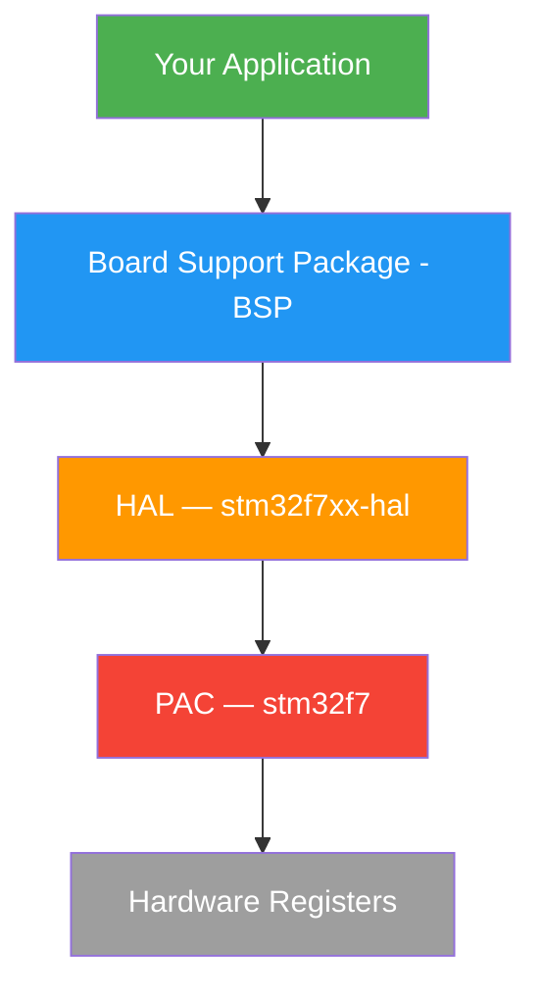

# Toolchain & Environment Setup

Setting up the complete Rust embedded development environment for the STM32F769I-DISCO.

## Installing the Embedded Toolchain

### Rust Cross-Compilation Target

The STM32F769 uses an ARM Cortex-M7 with hardware floating point. Install the matching target:

```bash
# Add the Cortex-M7 hard-float target
rustup target add thumbv7em-none-eabihf

# Verify installation
rustup target list --installed
# Should show: thumbv7em-none-eabihf
```

| Target Triple | Core | FPU | Use Case |
|:-------------|:-----|:----|:---------|
| `thumbv6m-none-eabi` | Cortex-M0/M0+ | None | Low-power MCUs |
| `thumbv7m-none-eabi` | Cortex-M3 | None | Mid-range MCUs |
| `thumbv7em-none-eabi` | Cortex-M4/M7 | Soft | When FPU unused |
| `thumbv7em-none-eabihf` | Cortex-M4/M7 | Hard | **STM32F769** |

### probe-rs

probe-rs is the modern tool for flashing, debugging, and logging on embedded Rust targets. It replaces the older OpenOCD + GDB workflow for most use cases.

```bash
# Install probe-rs (includes cargo-flash, cargo-embed)
curl --proto '=https' --tlsv1.2 -LsSf \
  https://github.com/probe-rs/probe-rs/releases/latest/download/probe-rs-tools-installer.sh \
  | sh

# Verify installation
probe-rs --version
cargo embed --version
cargo flash --version
```

probe-rs supports the STM32F769-DISCO's on-board ST-LINK/V2-1 debugger out of the box. Connect the board via USB and verify:

```bash
# List connected probes
probe-rs list

# Should show something like:
# [0]: STLink V2-1 (VID: 0483, PID: 374b, Serial: ...)
```

### Additional Tools

```bash
# Binary inspection tools
cargo install cargo-binutils
rustup component add llvm-tools

# Now available: cargo size, cargo objdump, cargo nm
cargo size --version
```

## IDE Setup

### VS Code with rust-analyzer

Install the **rust-analyzer** extension, then configure it for embedded development. Add to your workspace `.vscode/settings.json`:

```json
{
    "rust-analyzer.cargo.target": "thumbv7em-none-eabihf",
    "rust-analyzer.checkOnSave.allTargets": false,
    "rust-analyzer.checkOnSave.extraArgs": [
        "--target", "thumbv7em-none-eabihf"
    ]
}
```

This tells rust-analyzer to analyze code for the embedded target, so it correctly resolves `no_std` code and conditional compilation.

{: .tip }
> Install the **probe-rs** VS Code extension for integrated flashing and RTT log viewing directly in the editor.

## Project Configuration

A Rust embedded project requires three configuration files beyond the standard `Cargo.toml`.

### .cargo/config.toml

This sets the default build target and flash runner:

```toml
[build]
target = "thumbv7em-none-eabihf"

[target.thumbv7em-none-eabihf]
runner = "probe-rs run"
rustflags = [
    "-C", "link-arg=-Tlink.x",    # Use cortex-m-rt linker script
]

[env]
DEFMT_LOG = "debug"                # Default defmt log level
```

With this configuration, `cargo run` automatically flashes the binary to the STM32F769-DISCO and starts execution.

### memory.x

The linker script defines the flash and RAM layout for the STM32F769:

```
/* STM32F769NIH6 Memory Layout */
MEMORY
{
    FLASH  : ORIGIN = 0x08000000, LENGTH = 2M
    RAM    : ORIGIN = 0x20000000, LENGTH = 512K
}
```

The STM32F769 has additional memory regions (ITCM, DTCM, backup SRAM) that can be configured for advanced use cases — covered in [Bare Metal Runtime]().

### Cargo.toml

Core dependencies for an STM32F769 project:

```toml
[package]
name = "my-embedded-app"
version = "0.1.0"
edition = "2021"

[dependencies]
cortex-m = { version = "0.7", features = ["critical-section-single-core"] }
cortex-m-rt = "0.7"
panic-halt = "1.0"

# STM32F769 HAL
stm32f7xx-hal = { version = "0.8", features = ["stm32f769", "rt"] }

# Logging (optional but recommended)
defmt = "0.3"
defmt-rtt = "0.4"

[profile.release]
opt-level = "s"       # Optimize for size
lto = true            # Link-time optimization
debug = true          # Keep debug info for probe-rs
```

### Minimal main.rs

A complete, minimal embedded application:

```rust
#![no_std]
#![no_main]

use panic_halt as _;
use cortex_m_rt::entry;

#[entry]
fn main() -> ! {
    // Your code here
    loop {}
}
```

`#![no_std]` removes the standard library (no OS, no heap by default). `#![no_main]` tells the compiler that `cortex-m-rt` provides the entry point. The `#[entry]` function must return `!` (never return) because there is no OS to return to.

## Hardware Platform Overview

### STM32F769I-DISCO Board

The STM32F769I-DISCO evaluation board features:

| Component | Specification |
|:----------|:-------------|
| MCU | STM32F769NIH6 — Cortex-M7 @ 216MHz |
| Flash | 2MB internal |
| RAM | 512KB SRAM + 16KB DTCM |
| Display | 4" 800x472 capacitive touch LCD (DSI) |
| Networking | 10/100 Ethernet |
| External memory | 128Mbit SDRAM, 512Mbit QSPI flash |
| Storage | microSD slot |
| USB | USB OTG HS |
| Audio | SAI DAC, 4 MEMS microphones |
| Debugger | On-board ST-LINK/V2-1 |

### The PAC → HAL → BSP Stack

Rust embedded uses a layered abstraction:



| Layer | Crate | Purpose |
|:------|:------|:--------|
| **PAC** | `stm32f7` | Auto-generated register definitions from SVD files. Unsafe, low-level. |
| **HAL** | `stm32f7xx-hal` | Safe abstractions over the PAC. Implements `embedded-hal` traits. |
| **BSP** | (project-level) | Board-specific configuration: pin mappings, clock settings, peripheral init. |

The PAC provides raw register access (`peripherals.GPIOA.odr.modify(...)`). The HAL wraps this in safe, ergonomic APIs (`led.set_high()`). Your application code should primarily use HAL-level APIs.

{: .note }
> For a deeper look at `embedded-hal` traits and portable driver patterns, see [Embedded HAL]() in Part 6.

## Other Platforms

{: .warning }
> **Using a different board?** Here are the key differences for other popular platforms:
>
> | Platform | Target | HAL Crate | Tools |
> |:---------|:-------|:----------|:------|
> | **nRF52** | `thumbv7em-none-eabihf` | `nrf-hal` | probe-rs (J-Link or CMSIS-DAP) |
> | **ESP32** | `riscv32imc-unknown-none-elf` | `esp-hal` | `espup`, `espflash` (not probe-rs) |
> | **RP2040** | `thumbv6m-none-eabi` | `rp-hal` | probe-rs (Picoprobe or debug probe) |
>
> ESP32 uses a different toolchain installer (`espup`) and flash tool (`espflash`). See the [esp-rs book](https://docs.esp-rs.org/) for setup instructions.

## Best Practices

- **Pin your toolchain** with a `rust-toolchain.toml` file in your project root to ensure reproducible builds across machines
- **Use `probe-rs run`** as your cargo runner — it flashes, runs, and shows defmt logs in one command
- **Start with `panic-halt`** during early development, switch to `panic-probe` once debugging is set up (see [Debugging]())
- **Keep `debug = true`** even in release builds — probe-rs needs debug info for source-level debugging, and it doesn't affect the on-target binary size

## Next Steps

Your environment is ready. Continue to [Writing Embedded Software]() to write your first program on the STM32F769-DISCO.

[Example Code](https://github.com/MichaelTien8901/rust-guide-tutorial/tree/main/examples/part8/toolchain-setup)
