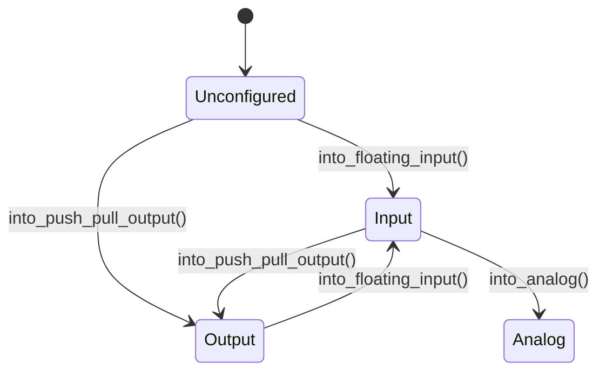
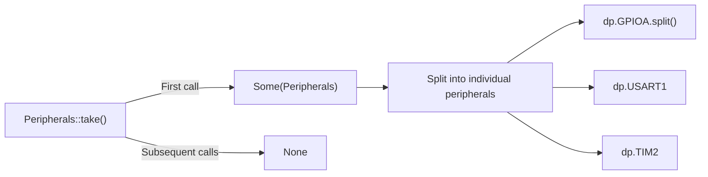

# Writing Embedded Software

Leveraging Rust's language features and HAL abstractions to write safe embedded code.

{: .note }
> **Prerequisites:** This chapter builds on [Embedded HAL]() from Part 6. Complete that chapter first if you haven't already.

## Rust's Strengths for Embedded

Rust's ownership and type system provide safety guarantees that are particularly valuable when programming hardware, where bugs can mean bricked devices or safety hazards.

### Ownership Prevents Peripheral Conflicts

In C, nothing stops two functions from writing to the same GPIO register simultaneously. In Rust, the ownership model enforces exclusive access:

```rust
// The HAL gives you owned peripheral structs
let mut led = gpioj.pj13.into_push_pull_output();
let mut buzzer = gpioj.pj5.into_push_pull_output();

// Each pin is a separate owned value — can't accidentally alias
led.set_high();
buzzer.set_low();

// This would NOT compile — led was already moved:
// let led2 = led;  // moved
// led.set_high();  // error: use of moved value
```

### Borrowing for Shared Access

When multiple parts of your code need to read (but not write) a peripheral:

```rust
fn read_temperature(adc: &Adc) -> u16 {
    // Immutable borrow — safe to call from multiple places
    adc.read_channel(0)
}

fn configure_heater(adc: &mut Adc, dac: &mut Dac) {
    // Mutable borrow — exclusive access guaranteed
    let temp = adc.read_channel(0);
    if temp < THRESHOLD {
        dac.set_value(255);
    }
}
```

The compiler enforces at compile time that you cannot have a mutable and immutable reference at the same time — preventing data races on hardware registers.

### Type-State Pattern for Hardware Safety

Use Rust's type system to make invalid hardware states unrepresentable:

```rust
// GPIO pin states as types — can't call write on an input pin
let pin = gpioa.pa0;                           // Unconfigured
let input_pin = pin.into_floating_input();      // Input mode
let output_pin = input_pin.into_push_pull_output(); // Output mode

output_pin.set_high();  // OK — it's an output
// input_pin.set_high(); // Won't compile — input_pin was consumed
```



## HAL Driver Patterns

### Clock Configuration

The first thing any embedded application must do is configure the system clocks. On the STM32F769, this sets up the PLL to reach 216MHz:

```rust
use stm32f7xx_hal::{pac, prelude::*, rcc::RccExt};

let dp = pac::Peripherals::take().unwrap();

// Configure clocks: HSE (25MHz crystal) -> PLL -> 216MHz SYSCLK
let rcc = dp.RCC.constrain();
let clocks = rcc.cfgr
    .hse(stm32f7xx_hal::rcc::HSEClock::new(
        25_000_000.Hz(),
        stm32f7xx_hal::rcc::HSEClockMode::Oscillator,
    ))
    .sysclk(216_000_000.Hz())
    .hclk(216_000_000.Hz())
    .pclk1(54_000_000.Hz())
    .pclk2(108_000_000.Hz())
    .freeze();
```

{: .important }
> Clock configuration must happen before using any peripheral. The `clocks` object is passed to peripheral constructors to ensure correct baud rates and timing.

### GPIO — Blinking an LED

The STM32F769I-DISCO has user LEDs on PJ13 (green) and PJ5 (red):

```rust
use stm32f7xx_hal::{pac, prelude::*, gpio::GpioExt, delay::Delay};
use cortex_m_rt::entry;

#[entry]
fn main() -> ! {
    let cp = cortex_m::Peripherals::take().unwrap();
    let dp = pac::Peripherals::take().unwrap();

    let rcc = dp.RCC.constrain();
    let clocks = rcc.cfgr.sysclk(216_000_000.Hz()).freeze();

    // Configure PJ13 as push-pull output
    let gpioj = dp.GPIOJ.split();
    let mut led = gpioj.pj13.into_push_pull_output();

    // SysTick-based delay
    let mut delay = Delay::new(cp.SYST, &clocks);

    loop {
        led.set_high();
        delay.delay_ms(500u32);
        led.set_low();
        delay.delay_ms(500u32);
    }
}
```

### UART Communication

Serial output through the ST-LINK Virtual COM Port (PA9 TX / PB7 RX):

```rust
use stm32f7xx_hal::serial::{self, Serial};

let gpioa = dp.GPIOA.split();
let gpiob = dp.GPIOB.split();

let tx_pin = gpioa.pa9.into_alternate();
let rx_pin = gpiob.pb7.into_alternate();

let mut serial = Serial::new(
    dp.USART1,
    (tx_pin, rx_pin),
    &clocks,
    serial::Config {
        baud_rate: 115_200.bps(),
        ..Default::default()
    },
);

// Write a byte
serial.write(b'H').ok();

// Read a byte (non-blocking)
match serial.read() {
    Ok(byte) => { /* received */ }
    Err(nb::Error::WouldBlock) => { /* no data yet */ }
    Err(nb::Error::Other(e)) => { /* error */ }
}
```

### Timer Usage

Hardware timers for precise timing without blocking the CPU:

```rust
use stm32f7xx_hal::timer::Timer;

// Configure TIM2 as a periodic timer (1 Hz)
let mut timer = Timer::new(dp.TIM2, &clocks).start_count_down(1.Hz());

loop {
    // Block until timer expires
    nb::block!(timer.wait()).ok();
    led.toggle();
}
```

## Peripheral Access Patterns

### The Singleton Pattern

Cortex-M peripherals exist at fixed memory addresses. The PAC ensures safe access through the singleton pattern:

```rust
use stm32f7xx_hal::pac;

// Take peripherals — returns Some() only once, None after that
let dp = pac::Peripherals::take().unwrap();

// Second call returns None — prevents aliasing
// let dp2 = pac::Peripherals::take(); // Returns None
```



### Critical Sections

When sharing data between interrupt handlers and the main loop, use critical sections:

```rust
use core::cell::RefCell;
use cortex_m::interrupt::{self, Mutex};

// Shared state protected by a Mutex
static SHARED: Mutex<RefCell<Option<u32>>> = Mutex::new(RefCell::new(None));

fn main_loop() {
    // Access shared state inside a critical section
    interrupt::free(|cs| {
        let mut shared = SHARED.borrow(cs).borrow_mut();
        *shared = Some(42);
    });
}
```

The `interrupt::free` closure disables interrupts for the duration, preventing data races. This pattern is covered in depth in [Bare Metal Runtime]().

## Inline Assembly

For operations that require direct hardware manipulation, Rust provides the `asm!` macro:

### Barrier Instructions

Cortex-M7 has instruction and data caches that can reorder memory accesses. Barrier instructions ensure ordering:

```rust
use core::arch::asm;

/// Data Synchronization Barrier — ensures all memory accesses complete
#[inline(always)]
fn dsb() {
    unsafe { asm!("dsb sy") };
}

/// Instruction Synchronization Barrier — flushes pipeline
#[inline(always)]
fn isb() {
    unsafe { asm!("isb") };
}

/// Data Memory Barrier — ensures memory access ordering
#[inline(always)]
fn dmb() {
    unsafe { asm!("dmb sy") };
}
```

{: .tip }
> The `cortex-m` crate provides safe wrappers for common barrier instructions via `cortex_m::asm::dsb()`, `cortex_m::asm::isb()`, etc. Prefer those over raw `asm!` unless you need custom barrier types.

### Reading Special Registers

Access the CPU cycle counter for precise timing measurements:

```rust
/// Read the CONTROL register
fn read_control() -> u32 {
    let value: u32;
    unsafe {
        asm!("mrs {}, CONTROL", out(reg) value);
    }
    value
}

/// Enable the DWT cycle counter for profiling
fn enable_cycle_counter() {
    unsafe {
        // DWT->CYCCNT is at 0xE0001004
        let dwt_ctrl = 0xE000_1000 as *mut u32;
        core::ptr::write_volatile(dwt_ctrl, core::ptr::read_volatile(dwt_ctrl) | 1);
    }
}
```

## Other Platforms

{: .warning }
> **Using a different board?** The HAL crate and pin names differ:
>
> | Platform | HAL Crate | LED Example |
> |:---------|:----------|:------------|
> | **nRF52840-DK** | `nrf-hal` | `p0.13` (LED1) |
> | **ESP32-C3** | `esp-hal` | `gpio.gpio8` |
> | **STM32F4 Discovery** | `stm32f4xx-hal` | `gpiod.pd12` (green LED) |
>
> The `embedded-hal` trait APIs (`OutputPin`, `InputPin`, `SpiDevice`) are identical across all platforms — only the HAL initialization differs.

## Best Practices

- **Configure clocks first** — all peripheral timing depends on the system clock
- **Use the HAL, not the PAC** — direct register manipulation is error-prone and non-portable
- **Prefer type-state APIs** — let the compiler catch invalid pin configurations
- **Avoid `unsafe` for peripheral access** — the HAL provides safe abstractions; use `unsafe` only for inline assembly or FFI
- **Use `nb::block!()` sparingly** — it busy-waits; prefer interrupt-driven or async approaches for production code (see [Async Concurrency]())

## Next Steps

Now that you can write embedded code, learn to debug it in [Debugging Embedded Applications]().

[Example Code](https://github.com/MichaelTien8901/rust-guide-tutorial/tree/main/examples/part8/embedded-software)
