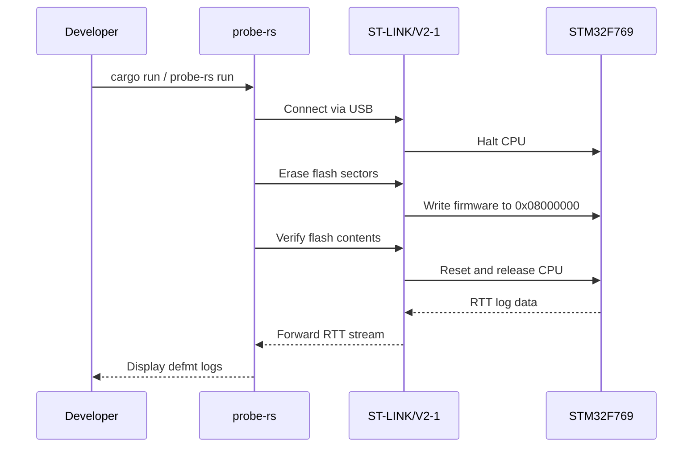
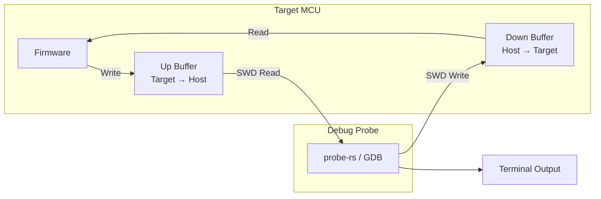

# Debugging Embedded Applications

Tools and techniques for debugging Rust firmware on the STM32F769I-DISCO.

{: .note }
> **Prerequisites:** This chapter assumes you have a working toolchain ([Toolchain Setup]()) and a flashable project ([Embedded Software]()). Your board should be connected via USB with the ST-LINK/V2-1 detected by `probe-rs list`.

## probe-rs Debugging Workflow

probe-rs is the primary tool for flashing, running, and debugging embedded Rust on the STM32F769I-DISCO. It communicates with the on-board ST-LINK/V2-1 debugger over USB.

### Flashing and Running

The simplest workflow uses `probe-rs run`, which flashes the binary, starts execution, and streams defmt logs:

```bash
# Build and flash in one step (uses runner from .cargo/config.toml)
cargo run --release

# Or flash explicitly
probe-rs run --chip STM32F769NIHx target/thumbv7em-none-eabihf/release/my-app
```



### cargo embed

`cargo embed` provides a richer experience with a terminal UI, RTT log viewer, and GDB server. Configure it with an `Embed.toml` at your project root:

```toml
[default.general]
chip = "STM32F769NIHx"

[default.rtt]
enabled = true

[default.gdb]
enabled = false       # Set to true to start GDB server

[default.reset]
halt_afterwards = false
```

```bash
# Flash, run, and view RTT logs in a TUI
cargo embed
```

{: .tip }
> Use `cargo embed` during iterative development for its live RTT log viewer. Use `probe-rs run` in CI/scripts where you need plain text output.

## GDB Debugging

For full source-level debugging with breakpoints, stepping, and memory inspection, connect GDB through a debug server.

### Starting a GDB Server

```bash
# Option 1: probe-rs GDB server (recommended)
probe-rs gdb --chip STM32F769NIHx

# Option 2: OpenOCD (if you need OpenOCD-specific features)
openocd -f interface/stlink-v2-1.cfg -f target/stm32f7x.cfg
```

### Connecting GDB

```bash
# Use the ARM GDB (from arm-none-eabi-gcc toolchain)
arm-none-eabi-gdb target/thumbv7em-none-eabihf/debug/my-app

# Or use GDB-multiarch
gdb-multiarch target/thumbv7em-none-eabihf/debug/my-app
```

Inside GDB, connect to the server:

```
(gdb) target remote :1337
Remote debugging using :1337
Reset () at src/main.rs:12

(gdb) load
Loading section .vector_table, size 0x400 lma 0x8000000
Loading section .text, size 0x1a3c lma 0x8000400
Start address 0x08000400, load size 7740
Transfer rate: 12 KB/sec, 3870 bytes/write.
```

### Essential GDB Commands

| Command | Shortcut | Description |
|:--------|:---------|:------------|
| `break main` | `b main` | Set breakpoint at function |
| `break src/main.rs:42` | `b src/main.rs:42` | Set breakpoint at line |
| `continue` | `c` | Resume execution |
| `step` | `s` | Step into function call |
| `next` | `n` | Step over function call |
| `finish` | `fin` | Run until current function returns |
| `print variable` | `p variable` | Print variable value |
| `print/x variable` | `p/x variable` | Print as hexadecimal |
| `x/16xw 0x20000000` | | Examine 16 words at RAM start |
| `x/8xb 0x08000000` | | Examine 8 bytes at flash start |
| `backtrace` | `bt` | Show call stack |
| `info registers` | `i r` | Show all CPU registers |
| `info break` | `i b` | List all breakpoints |
| `delete 1` | `d 1` | Delete breakpoint #1 |
| `monitor reset halt` | | Reset and halt the target |

### A Typical GDB Session

```
(gdb) target remote :1337
(gdb) load
(gdb) break main
Breakpoint 1 at 0x080004a2: file src/main.rs, line 15.

(gdb) continue
Breakpoint 1, main () at src/main.rs:15
15      let dp = pac::Peripherals::take().unwrap();

(gdb) next
16      let cp = cortex_m::Peripherals::take().unwrap();

(gdb) next
18      let rcc = dp.RCC.constrain();

(gdb) print clocks
$1 = Clocks { hclk: 216000000, pclk1: 54000000, pclk2: 108000000, ... }

(gdb) info registers
r0    0x20000100   536871168
r1    0x00000001   1
sp    0x20080000   0x20080000
pc    0x080004b8   0x080004b8 <main+22>
xpsr  0x01000000   16777216

(gdb) x/4xw 0x40023800
0x40023800:  0x00000483  0x24003010  0x00000000  0x00000000

(gdb) continue
```

## defmt Logging

[defmt](https://defmt.ferrous-systems.com/) (deferred formatting) is a highly efficient logging framework designed for embedded targets. It sends compact encoded data over RTT and defers string formatting to the host, keeping firmware size small and execution fast.

### Setup

Add these dependencies to `Cargo.toml`:

```toml
[dependencies]
defmt = "0.3"
defmt-rtt = "0.4"         # RTT transport for defmt
panic-probe = { version = "0.3", features = ["print-defmt"] }
```

Set the log level in `.cargo/config.toml`:

```toml
[env]
DEFMT_LOG = "debug"    # trace, debug, info, warn, error
```

{: .important }
> You must import `defmt_rtt` and `panic_probe` with `use ... as _` in your binary to ensure the linker includes them, even though you never call them directly.

### Code Example

```rust
#![no_std]
#![no_main]

use defmt_rtt as _;
use panic_probe as _;

use cortex_m_rt::entry;
use stm32f7xx_hal::{pac, prelude::*};

#[entry]
fn main() -> ! {
    defmt::info!("Booting firmware...");

    let dp = pac::Peripherals::take().unwrap();
    let rcc = dp.RCC.constrain();
    let clocks = rcc.cfgr.sysclk(216_000_000.Hz()).freeze();

    defmt::debug!("System clock: {} Hz", clocks.sysclk().raw());

    let gpioj = dp.GPIOJ.split();
    let mut led = gpioj.pj13.into_push_pull_output();

    let mut count: u32 = 0;
    loop {
        led.toggle();
        count = count.wrapping_add(1);

        if count % 100 == 0 {
            defmt::info!("Blink count: {}", count);
        }

        if count > 10_000 {
            defmt::warn!("High blink count: {}", count);
        }

        cortex_m::asm::delay(216_000_000 / 4);
    }
}
```

### Log Levels

defmt supports five log levels, filtered at compile time by the `DEFMT_LOG` environment variable:

| Level | Macro | Use Case |
|:------|:------|:---------|
| `trace` | `defmt::trace!()` | High-frequency data (sensor reads, register dumps) |
| `debug` | `defmt::debug!()` | Development diagnostics (clock config, peripheral init) |
| `info` | `defmt::info!()` | Normal operational events (boot, state transitions) |
| `warn` | `defmt::warn!()` | Recoverable issues (retry, fallback) |
| `error` | `defmt::error!()` | Failures that affect operation |

{: .tip }
> Logs below the configured level are stripped at compile time. A release build with `DEFMT_LOG=info` includes zero overhead from `trace!` and `debug!` calls.

### Viewing defmt Logs

When you use `probe-rs run` or `cargo embed`, defmt logs are decoded and printed automatically:

```
$ cargo run --release
    Flashing firmware...
    Finished in 1.2s
0.000000 INFO  Booting firmware...
0.000042 DEBUG System clock: 216000000 Hz
0.250000 INFO  Blink count: 100
0.500000 INFO  Blink count: 200
```

## RTT (Real-Time Transfer)

RTT is a bidirectional communication channel between the target MCU and the debug probe. It uses a shared memory buffer in target RAM that the debugger reads via the SWD interface -- no extra pins or UART needed.

### How RTT Works



The firmware writes log data into a ring buffer in RAM. The debug probe periodically reads this buffer through the SWD debug interface. Because RTT uses background memory reads rather than halting the CPU, it has minimal impact on real-time behavior.

### RTT vs Semihosting

| Feature | RTT | Semihosting |
|:--------|:----|:------------|
| **Speed** | ~1 MB/s | ~1 KB/s |
| **Blocking** | Non-blocking (ring buffer) | Blocks CPU on each call |
| **CPU halt** | No | Yes (breakpoint instruction) |
| **Extra hardware** | None (uses SWD) | None (uses SWD) |
| **Requires debugger** | Yes | Yes |
| **Use case** | Production logging, real-time data | Slow debug output, file I/O |
| **Impact on timing** | Negligible | Severe (breaks real-time) |

{: .warning }
> Never use semihosting in time-sensitive code. A single semihosting `println!` can take milliseconds and disrupts interrupt timing. Use RTT with defmt instead.

### RTT Configuration in Embed.toml

```toml
[default.rtt]
enabled = true
# Number of up (target->host) channels
up_channels = 1
# Number of down (host->target) channels
down_channels = 0
# Show timestamps
show_timestamps = true
# Log file (optional)
# log_file = "rtt.log"
```

## Hardware Breakpoints and Watchpoints

The Cortex-M7 core in the STM32F769 provides limited but powerful hardware debug resources. Unlike software breakpoints (which modify code in RAM), hardware breakpoints work on code in flash without modifying it.

### Available Resources

| Resource | Unit | Count | Purpose |
|:---------|:-----|:------|:--------|
| Hardware breakpoints | FPB (Flash Patch and Breakpoint) | 8 | Break on instruction address |
| Watchpoints | DWT (Data Watchpoint and Trace) | 4 | Break on data access |

### Using Hardware Breakpoints in GDB

```
(gdb) hbreak main
Hardware assisted breakpoint 1 at 0x080004a2: file src/main.rs, line 15.

(gdb) hbreak *0x08000400
Hardware assisted breakpoint 2 at 0x08000400

(gdb) info break
Num  Type           Disp Enb Address    What
1    hw breakpoint  keep y   0x080004a2 in main at src/main.rs:15
2    hw breakpoint  keep y   0x08000400

(gdb) delete 2
```

{: .note }
> GDB automatically uses hardware breakpoints when setting breakpoints on flash-resident code. The `hbreak` command explicitly requests hardware breakpoints. If you exhaust all 8, GDB will report an error.

### Using Watchpoints in GDB

Watchpoints halt the CPU when a specific memory address is read or written:

```
(gdb) # Break when variable 'count' is written
(gdb) watch count
Hardware watchpoint 3: count

(gdb) # Break when a specific address is written
(gdb) watch *(uint32_t *)0x20000100
Hardware watchpoint 4: *(uint32_t *)0x20000100

(gdb) # Break on read access (access watchpoint)
(gdb) awatch *(uint32_t *)0x20000100
Hardware access watchpoint 5: *(uint32_t *)0x20000100

(gdb) continue
Hardware watchpoint 3: count
Old value = 99
New value = 100
main () at src/main.rs:28
28          count = count.wrapping_add(1);
```

Watchpoints are invaluable for tracking down memory corruption, unexpected register writes, and race conditions between interrupts and the main loop.

## Common Debugging Pitfalls

### Optimized-Out Variables

The compiler may eliminate variables that appear unused or can be constant-folded. This makes them invisible in the debugger.

**Symptoms:** GDB shows `<optimized out>` for a variable you want to inspect.

**Solutions:**

```rust
// 1. Build with lower optimization (in Cargo.toml)
// [profile.dev]
// opt-level = 1    # Enough for size, keeps most debug info

// 2. Mark functions to prevent inlining
#[inline(never)]
fn process_sensor(value: u16) -> u16 {
    let scaled = value * 3;     // Now visible in debugger
    let filtered = scaled / 2;
    filtered
}

// 3. Use volatile read to force the compiler to keep a value
fn debug_keep<T>(value: &T) {
    unsafe {
        core::ptr::read_volatile(value as *const T);
    }
}
```

{: .tip }
> In your `Cargo.toml`, setting `opt-level = 1` in the dev profile gives a good balance: the binary is small enough to fit in flash, and most variables remain visible in the debugger.

### Interrupts During Debug Stepping

When you single-step through code, interrupts may still fire between steps, causing confusing jumps into interrupt handlers.

**Solutions:**

```
(gdb) # Disable all maskable interrupts during stepping
(gdb) set $primask = 1

(gdb) # Step through your code
(gdb) next
(gdb) next

(gdb) # Re-enable interrupts
(gdb) set $primask = 0
(gdb) continue
```

Alternatively, configure your debug session to mask interrupts automatically when halted. In probe-rs, the `vector_catch` setting handles this for exceptions.

### Flash Verification Failures

If flashing fails or the firmware behaves unexpectedly after flashing:

```bash
# Perform a full chip erase before flashing
probe-rs erase --chip STM32F769NIHx

# Flash with verification
probe-rs download --chip STM32F769NIHx --verify target/thumbv7em-none-eabihf/release/my-app

# Check binary size against available flash (2MB)
cargo size --release -- -A
```

Common causes include binary too large for flash, stale flash protection bits, and incorrect memory.x configuration.

### Debugging Startup Code Before main

The `cortex-m-rt` runtime performs setup before your `#[entry]` function: copying `.data` from flash to RAM, zeroing `.bss`, and calling initializers. To debug this early code:

```
(gdb) # Break at the very first instruction (reset handler)
(gdb) break Reset

(gdb) # Or set a breakpoint at the reset vector address
(gdb) hbreak *0x08000004

(gdb) monitor reset halt
(gdb) continue

Breakpoint 1, Reset () at cortex-m-rt-0.7.3/src/lib.rs:497
497     pub unsafe extern "C" fn Reset() -> ! {

(gdb) # Now step through the startup code
(gdb) step
```

## Other Platforms

{: .warning }
> **Using a different board?** Debugging tools vary by platform:
>
> | Platform | Debug Probe | Tools | Notes |
> |:---------|:------------|:------|:------|
> | **nRF52840-DK** | J-Link (on-board) | probe-rs, nRF Connect for VS Code | nRF Connect extension provides integrated RTT viewer and flash programmer |
> | **ESP32-C3** | USB-JTAG (built-in) | `espflash`, OpenOCD with ESP-specific config | Use `espflash monitor` for serial output; OpenOCD requires [ESP fork](https://github.com/espressif/openocd-esp32) |
> | **RP2040** | Picoprobe / Debug Probe | probe-rs | Second Pico can serve as debug probe via Picoprobe firmware |
>
> probe-rs supports J-Link, ST-LINK, and CMSIS-DAP probes. ESP32 targets require the Espressif-specific tooling for flash and debug.

## Best Practices

- **Use defmt over UART logging** -- defmt over RTT is faster, non-blocking, and does not require extra pins or a serial adapter
- **Keep debug info in release builds** -- set `debug = true` in `[profile.release]` so probe-rs and GDB can show source-level information without affecting on-target binary size
- **Start with `opt-level = 1`** for debug builds -- it keeps most variables visible while producing binaries small enough for flash
- **Prefer `panic-probe` over `panic-halt`** -- it prints a backtrace and defmt-formatted panic message before halting
- **Use hardware watchpoints sparingly** -- you only have 4; save them for tracking down memory corruption and register side effects
- **Test with `DEFMT_LOG=trace` during development**, then ship with `DEFMT_LOG=info` or higher to reduce binary size
- **Use `cargo embed` during interactive development** and `probe-rs run` in automated scripts and CI
- **Version your `Embed.toml`** -- commit it to source control so the entire team shares the same debug configuration

## Next Steps

With debugging tools in your workflow, continue to [Bare Metal Runtime]() to understand what happens between power-on and your `#[entry]` function.

[Example Code](https://github.com/MichaelTien8901/rust-guide-tutorial/tree/main/examples/part8/debugging)
