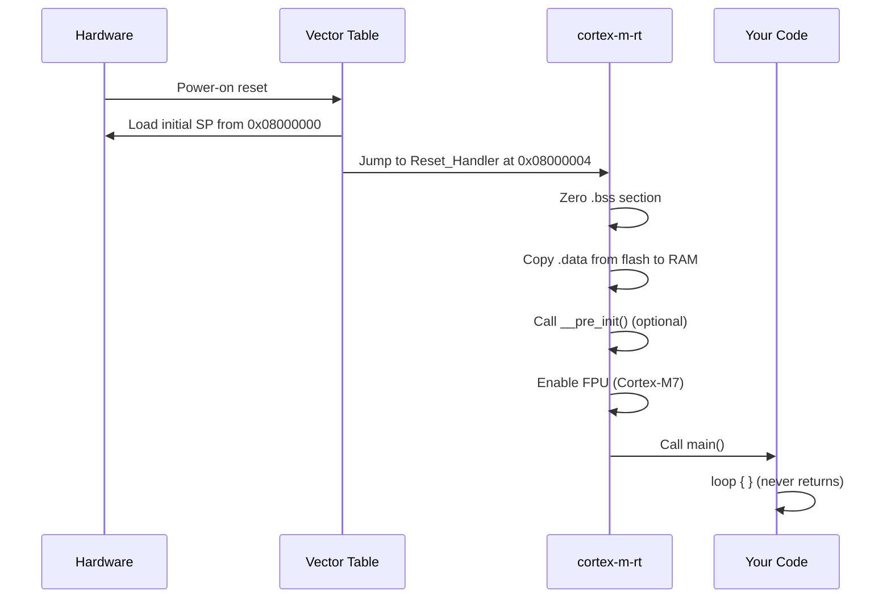
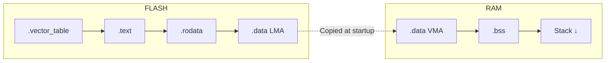
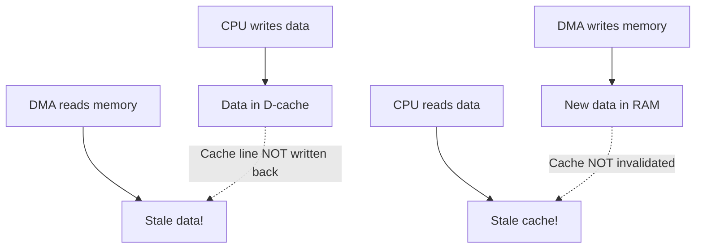

# Bare Metal Runtime

Understanding the journey from reset vector to your main function.

{: .note }
> **Prerequisites:** This chapter builds on [Bare Metal]() from Part 6. Complete that chapter first if you haven't already.

## The Boot Sequence

When the STM32F769 powers on, the Cortex-M7 core executes a precisely defined startup sequence. Understanding this sequence is essential for debugging early boot issues and customizing the runtime.



### What Happens at Reset

1. **SP initialization** — The processor loads the initial stack pointer from address `0x08000000` (first word of the vector table)
2. **Reset handler** — The processor loads the reset vector from `0x08000004` and begins execution
3. **Runtime init** — `cortex-m-rt` zeroes `.bss`, copies `.data`, optionally calls `__pre_init()`
4. **FPU enable** — On Cortex-M7, the FPU is enabled before entering user code
5. **main()** — Your `#[entry]` function is called

{: .important }
> The `#[entry]` function must return `!` (never return). There is no OS to return to — returning from main would execute whatever happens to be next in memory, causing undefined behavior.

## The Vector Table

The Cortex-M vector table is an array of function pointers at the start of flash memory. The first 16 entries are defined by ARM:

| Offset | Exception | Description |
|:-------|:----------|:------------|
| `0x00` | — | Initial Stack Pointer value |
| `0x04` | Reset | Entry point after reset |
| `0x08` | NMI | Non-Maskable Interrupt |
| `0x0C` | HardFault | All faults if no specific handler |
| `0x10` | MemManage | Memory protection fault |
| `0x14` | BusFault | Bus error |
| `0x18` | UsageFault | Undefined instruction, alignment |
| `0x2C` | SVCall | Supervisor call (SVC instruction) |
| `0x38` | PendSV | Pendable request for system service |
| `0x3C` | SysTick | System timer tick |
| `0x40+` | IRQ0... | Device-specific interrupts |

### Exception Handlers in Rust

`cortex-m-rt` provides the `#[exception]` attribute for registering exception handlers:

```rust
use cortex_m_rt::exception;

#[exception]
unsafe fn HardFault(ef: &cortex_m_rt::ExceptionFrame) -> ! {
    // Log the exception frame for debugging
    // ef contains: r0, r1, r2, r3, r12, lr, pc, xpsr
    panic!("HardFault at PC={:#010x}", ef.pc());
}

#[exception]
fn SysTick() {
    // Called every SysTick period
    // Used for timekeeping, RTOS tick, etc.
}

#[exception]
unsafe fn DefaultHandler(irqn: i16) {
    // Catches any unhandled interrupt
    panic!("Unhandled IRQ: {}", irqn);
}
```

{: .tip }
> During development, always implement a `HardFault` handler that logs the exception frame. Without it, faults silently loop and are nearly impossible to debug.

## Linker Script Structure

### Memory Regions

The `memory.x` file defines the physical memory layout. For the STM32F769, the full memory map is:

```
/* STM32F769NIH6 Full Memory Map */
MEMORY
{
    /* Primary regions (used by default) */
    FLASH  : ORIGIN = 0x08000000, LENGTH = 2M
    RAM    : ORIGIN = 0x20000000, LENGTH = 512K

    /* Special regions (for advanced use) */
    ITCM   : ORIGIN = 0x00000000, LENGTH = 16K   /* Instruction TCM */
    DTCM   : ORIGIN = 0x20000000, LENGTH = 16K   /* Data TCM, zero wait */
    SRAM1  : ORIGIN = 0x20020000, LENGTH = 368K   /* Main SRAM */
    SRAM2  : ORIGIN = 0x20078000, LENGTH = 16K    /* Additional SRAM */
}
```

### Sections Layout

The `cortex-m-rt` linker script (`link.x`, included via `-Tlink.x` in `.cargo/config.toml`) defines how code and data are placed:



| Section | Location | Contents |
|:--------|:---------|:---------|
| `.vector_table` | Flash start | Exception vectors, initial SP |
| `.text` | Flash | Executable code |
| `.rodata` | Flash | Constants, string literals |
| `.data` | Flash (LMA), RAM (VMA) | Initialized static variables |
| `.bss` | RAM | Uninitialized static variables (zeroed) |
| Stack | RAM (top, grows down) | Call stack |

### Placing Code in ITCM/DTCM

For performance-critical code on the STM32F769, use custom sections:

```rust
// Place a function in ITCM (zero-wait-state instruction memory)
#[link_section = ".itcm"]
fn fast_isr_handler() {
    // This runs from ITCM — faster than flash
}

// Place data in DTCM (zero-wait-state data memory)
#[link_section = ".dtcm"]
static mut FAST_BUFFER: [u8; 256] = [0; 256];
```

This requires adding the corresponding sections to your linker script — see the STM32F769 reference manual for the complete memory map.

## .bss and .data Initialization

### Why Initialization Matters

Before Rust code can safely execute, the runtime must:

1. **Zero `.bss`** — Uninitialized statics (`static mut X: u32 = 0`) live in `.bss`. The C standard (and Rust) guarantees they start as zero. Flash contains no data for `.bss` — the startup code must write zeros to RAM.

2. **Copy `.data`** — Initialized statics (`static X: u32 = 42`) have their values stored in flash (LMA) but are accessed from RAM (VMA). The startup code copies the initial values from flash to RAM.

```rust
// Lives in .bss — zeroed by startup code
static mut COUNTER: u32 = 0;

// Lives in .data — copied from flash by startup code
static GREETING: &str = "Hello, embedded!";

// Lives in .rodata — stays in flash, read directly
const MAX_RETRIES: u32 = 5;
```

{: .note }
> `const` values are inlined at each use site and live in `.rodata` (flash). `static` values have a fixed address in RAM. Prefer `const` for read-only values to save RAM.

### The cortex-m-rt Startup Code

`cortex-m-rt` handles all of this automatically. The generated startup code (in assembly) does:

```
Reset_Handler:
    ldr r0, =_sbss       @ Start of .bss
    ldr r1, =_ebss       @ End of .bss
    movs r2, #0
bss_loop:
    cmp r0, r1
    bge bss_done
    str r2, [r0], #4     @ Write zero, advance pointer
    b bss_loop
bss_done:
    ldr r0, =_sdata      @ Start of .data (RAM VMA)
    ldr r1, =_edata      @ End of .data
    ldr r2, =_sidata     @ Start of .data (Flash LMA)
data_loop:
    cmp r0, r1
    bge data_done
    ldr r3, [r2], #4     @ Read from flash
    str r3, [r0], #4     @ Write to RAM
    b data_loop
data_done:
    bl main               @ Call user code
```

## Interrupt Handlers

### Registering Interrupt Handlers

Device-specific interrupts (beyond the core exceptions) use the `#[interrupt]` attribute from the PAC:

```rust
use stm32f7xx_hal::pac::interrupt;

#[interrupt]
fn EXTI0() {
    // Handles EXTI line 0 interrupt (e.g., PA0 button press)
    // Clear the pending bit to acknowledge
}

#[interrupt]
fn TIM2() {
    // Handles TIM2 update interrupt
}
```

### NVIC Priority Configuration

The STM32F769 (Cortex-M7) supports 4 bits of priority (16 levels, 0 = highest):

```rust
use cortex_m::peripheral::NVIC;
use stm32f7xx_hal::pac::Interrupt;

unsafe {
    // Set priority (0 = highest, 15 = lowest)
    let mut nvic = cortex_m::Peripherals::take().unwrap().NVIC;
    nvic.set_priority(Interrupt::EXTI0, 1);
    nvic.set_priority(Interrupt::TIM2, 4);

    // Enable the interrupts
    NVIC::unmask(Interrupt::EXTI0);
    NVIC::unmask(Interrupt::TIM2);
}
```

### Sharing Data Between Interrupt and Main

The standard pattern uses `Mutex<RefCell<Option<T>>>` with critical sections:

```rust
use core::cell::RefCell;
use cortex_m::interrupt::{self, Mutex};
use stm32f7xx_hal::gpio::{Output, PushPull, PJ13};

// Shared peripheral — wrapped for safe access
static LED: Mutex<RefCell<Option<PJ13<Output<PushPull>>>>> =
    Mutex::new(RefCell::new(None));

#[entry]
fn main() -> ! {
    // ... setup code ...
    let led = gpioj.pj13.into_push_pull_output();

    // Move the LED into the shared static
    interrupt::free(|cs| {
        LED.borrow(cs).replace(Some(led));
    });

    // Enable EXTI0 interrupt for button
    // ...

    loop {
        cortex_m::asm::wfi(); // Wait for interrupt
    }
}

#[interrupt]
fn EXTI0() {
    interrupt::free(|cs| {
        if let Some(ref mut led) = LED.borrow(cs).borrow_mut().as_mut() {
            led.toggle();
        }
    });
}
```

{: .important }
> Never use `static mut` directly for shared data — it's unsound. The `Mutex<RefCell<Option<T>>>` pattern ensures exclusive access via critical sections. For a more ergonomic alternative, see the `critical-section` crate.

## Cortex-M7 Cache

The STM32F769's Cortex-M7 has separate instruction and data caches:

| Cache | Size | Purpose |
|:------|:-----|:--------|
| I-cache | 16 KB | Speeds up instruction fetch from flash |
| D-cache | 16 KB | Speeds up data access from SRAM |

### Enabling Caches

```rust
let mut cp = cortex_m::Peripherals::take().unwrap();

// Enable instruction cache (safe, always beneficial)
cp.SCB.enable_icache();

// Enable data cache (requires care with DMA!)
unsafe { cp.SCB.enable_dcache(&mut cp.CPUID) };
```

### DMA and Cache Coherency

When using DMA, the DMA controller reads/writes directly to memory, bypassing the cache. This creates coherency issues:



**Before DMA transmit** (CPU → DMA): clean the cache to flush data to RAM:

```rust
// Clean cache lines for the DMA buffer
let buf_addr = buffer.as_ptr() as usize;
let buf_size = buffer.len();
cortex_m::asm::dsb();
unsafe {
    cp.SCB.clean_dcache_by_address(buf_addr, buf_size);
}
```

**After DMA receive** (DMA → CPU): invalidate the cache to discard stale data:

```rust
// Invalidate cache lines to read fresh DMA data
unsafe {
    cp.SCB.invalidate_dcache_by_address(buf_addr, buf_size);
}
cortex_m::asm::dsb();
```

{: .tip }
> For DMA buffers, the simplest approach is to place them in DTCM (which is not cached) or mark the memory region as non-cacheable in the MPU. This avoids cache maintenance entirely.

## Best Practices

- **Always implement `HardFault`** — log the exception frame for post-mortem debugging
- **Use `wfi` in idle loops** — `cortex_m::asm::wfi()` saves power by sleeping until the next interrupt
- **Prefer `const` over `static`** — saves RAM since `const` values stay in flash
- **Enable I-cache unconditionally** — it's always safe and improves performance
- **Be cautious with D-cache** — only enable if you handle DMA coherency correctly
- **Use `critical-section` crate** — newer, more ergonomic alternative to `cortex_m::interrupt::free`

## Next Steps

Now that you understand the runtime, learn how memory is managed in [Memory Management in no_std]().

[Example Code](https://github.com/MichaelTien8901/rust-guide-tutorial/tree/main/examples/part8/bare-metal-runtime)
