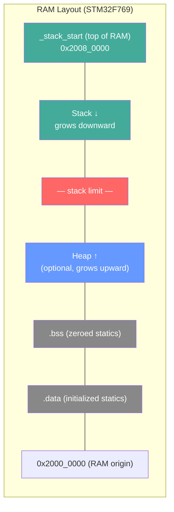
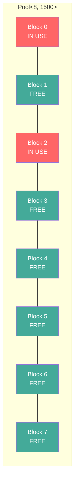
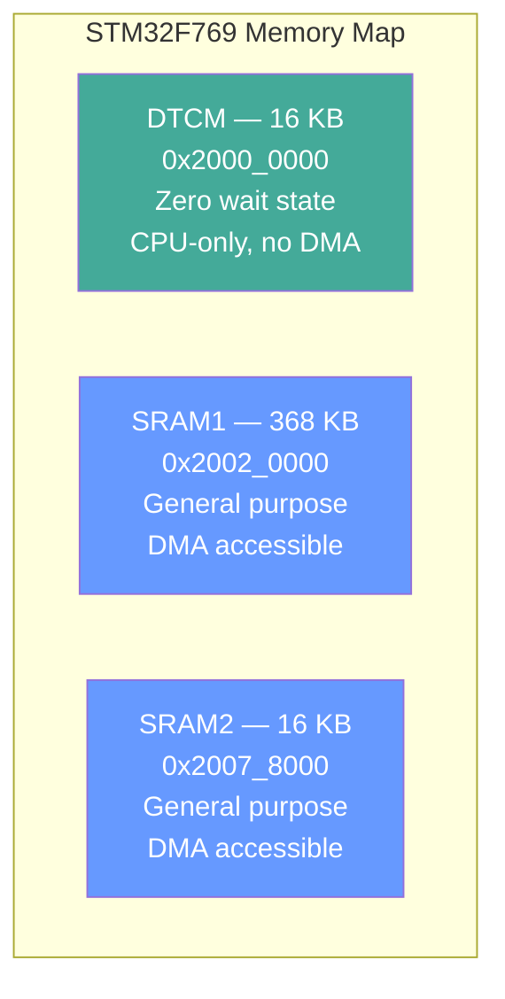

# Memory Management in no_std

Allocation strategies for systems without a heap, and when to add one.

{: .note }
> **Prerequisites:** This chapter builds on [no_std Basics]() from Part 6. Complete that chapter first if you haven't already.

## Stack vs Heap in Embedded

On a desktop OS the stack grows dynamically and the heap is managed by `malloc`. On a bare-metal Cortex-M target, **you** decide how much stack and heap exist — and the hardware enforces those limits harshly.

### Stack Configuration in the Linker Script

The stack size is set in `memory.x` and consumed by the `cortex-m-rt` linker script:

```
/* memory.x — STM32F769 */
MEMORY
{
    FLASH : ORIGIN = 0x08000000, LENGTH = 2M
    RAM   : ORIGIN = 0x20000000, LENGTH = 512K
}

/* Reserve 8 KB for the stack (grows downward from top of RAM) */
_stack_start = ORIGIN(RAM) + LENGTH(RAM);
_stack_size  = 0x2000;  /* 8 KB — adjust per application */
```

The Cortex-M stack grows **downward** from `_stack_start`. If a function call pushes the stack pointer below the reserved region, the write may corrupt `.bss` or `.data`, triggering a **HardFault** — or worse, silent data corruption.



### Estimating Stack Usage

You cannot rely on a debugger to catch every overflow. Proactive strategies include:

- **Static analysis** — `cargo call-stack` (nightly) computes the worst-case call depth for each interrupt priority level
- **Paint-and-check** — fill the stack region with a sentinel (e.g., `0xDEADBEEF`) at startup and periodically scan for the high-water mark
- **Cortex-M MPU** — configure a "guard" region at the stack limit that triggers a MemManage fault on access

{: .warning }
> On Cortex-M, a stack overflow does **not** produce a clean error. The processor may HardFault, or it may silently overwrite other data. Always estimate worst-case usage and add a safety margin.

### When Is a Heap Justified?

Most embedded applications work entirely on the stack and in static memory. Consider a heap only when:

- You need **dynamically sized** buffers (e.g., varying-length network packets)
- Third-party crates require `alloc` types (`Box`, `Vec`, `String`)
- You accept the trade-offs: fragmentation risk, non-deterministic allocation time, increased code size

## Heapless Data Structures

The [`heapless`](https://crates.io/crates/heapless) crate provides fixed-capacity, stack-allocated collections that never allocate from a heap. This is the **default choice** for embedded Rust.

### Vec, String, and LinearMap

```rust
use heapless::Vec;
use heapless::String;
use heapless::LinearMap;

// Fixed-capacity vector — stores up to 8 elements on the stack
let mut readings: Vec<u16, 8> = Vec::new();
readings.push(1023).unwrap(); // Returns Err if full
readings.push(512).unwrap();

// Fixed-capacity string — 64-byte buffer
let mut msg: String<64> = String::new();
core::fmt::write(&mut msg, format_args!("ADC: {}", readings[0]))
    .unwrap();

// Fixed-capacity map — up to 4 key-value pairs
let mut config: LinearMap<&str, u32, 4> = LinearMap::new();
config.insert("baud", 115200).unwrap();
config.insert("timeout_ms", 500).unwrap();
```

### Lock-Free Queue for Interrupt Communication

`heapless::spsc::Queue` is a single-producer, single-consumer ring buffer — perfect for passing data from an ISR to the main loop **without** a critical section:

```rust
use heapless::spsc::Queue;

// Shared between ISR (producer) and main (consumer)
static mut QUEUE: Queue<u16, 16> = Queue::new();

#[entry]
fn main() -> ! {
    // Safety: split once at startup, before interrupts are enabled
    let (mut producer, mut consumer) = unsafe { QUEUE.split() };
    // Move `producer` into the ISR context...

    loop {
        if let Some(sample) = consumer.dequeue() {
            // Process the ADC sample
        }
        cortex_m::asm::wfi();
    }
}

#[interrupt]
fn ADC() {
    // producer.enqueue(adc_value).ok();
}
```

{: .tip }
> `spsc::Queue` uses atomic operations internally and is safe to use across exactly **one** producer and **one** consumer (e.g., ISR and main loop). For multiple producers, use a `Mutex`-protected collection instead.

### Handling Full Capacity

Every `push`, `insert`, or `enqueue` on a heapless collection returns a `Result`. In embedded code, you must decide what to do when the collection is full:

```rust
match readings.push(new_value) {
    Ok(()) => { /* stored */ }
    Err(_) => {
        // Strategy 1: Drop oldest (shift and retry)
        // Strategy 2: Overwrite last
        // Strategy 3: Log overflow and discard
        defmt::warn!("readings buffer full, discarding sample");
    }
}
```

## Custom Allocators

When heapless collections are not sufficient, you can enable the `alloc` crate and provide a global allocator.

### Setting Up embedded-alloc

The [`embedded-alloc`](https://crates.io/crates/embedded-alloc) crate (formerly `alloc-cortex-m`) provides a simple first-fit allocator suitable for embedded targets:

```rust
#![no_std]
#![no_main]

extern crate alloc;

use alloc::vec::Vec;
use alloc::string::String;
use embedded_alloc::LlffHeap as Heap;

#[global_allocator]
static HEAP: Heap = Heap::empty();

#[entry]
fn main() -> ! {
    // Initialize the allocator with a region of RAM
    {
        // Heap occupies 4 KB starting after .bss
        const HEAP_SIZE: usize = 4096;
        static mut HEAP_MEM: [u8; HEAP_SIZE] = [0; HEAP_SIZE];
        unsafe { HEAP.init(HEAP_MEM.as_ptr() as usize, HEAP_SIZE) }
    }

    // Now `alloc` types work
    let mut data: Vec<u8> = Vec::with_capacity(128);
    data.extend_from_slice(b"Hello from the heap");

    let msg = String::from("Heap-allocated string");

    loop {
        cortex_m::asm::wfi();
    }
}
```

### alloc vs Heapless: Trade-Offs

| Aspect | Heapless | alloc + embedded-alloc |
|:-------|:---------|:-----------------------|
| **Allocation time** | O(1), deterministic | Variable (first-fit search) |
| **Fragmentation** | Impossible | Possible over time |
| **Code size** | Minimal | Adds ~2-4 KB for allocator |
| **Capacity** | Fixed at compile time | Dynamic at runtime |
| **OOM handling** | `Result` on every push | `#[alloc_error_handler]` or panic |
| **Typical use** | Sensor buffers, configs | Protocol stacks, dynamic messages |

{: .important }
> In safety-critical or long-running systems, avoid `alloc`. Fragmentation can cause allocation failures hours or days after deployment. If you must use `alloc`, allocate everything at startup and never free.

## Memory Pools

When you need dynamic allocation **without** fragmentation, use a memory pool: a pre-allocated set of fixed-size blocks.

### Simple Pool Implementation

```rust
use core::cell::RefCell;
use cortex_m::interrupt::Mutex;

/// A pool of N fixed-size buffers, each BLOCK_SIZE bytes.
pub struct Pool<const N: usize, const BLOCK_SIZE: usize> {
    storage: [[u8; BLOCK_SIZE]; N],
    free: [bool; N],
}

impl<const N: usize, const BLOCK_SIZE: usize> Pool<N, BLOCK_SIZE> {
    pub const fn new() -> Self {
        Self {
            storage: [[0u8; BLOCK_SIZE]; N],
            free: [true; N],
        }
    }

    /// Allocate a block. Returns None if pool is exhausted.
    pub fn alloc(&mut self) -> Option<&mut [u8; BLOCK_SIZE]> {
        for i in 0..N {
            if self.free[i] {
                self.free[i] = false;
                return Some(&mut self.storage[i]);
            }
        }
        None // Pool exhausted
    }

    /// Return a block to the pool by index.
    pub fn dealloc(&mut self, index: usize) {
        assert!(index < N, "Invalid pool index");
        self.free[index] = true;
    }

    /// Number of free blocks remaining.
    pub fn available(&self) -> usize {
        self.free.iter().filter(|&&f| f).count()
    }
}
```

### Use Case: Network Packet Buffers

```rust
// 8 packet buffers, each 1500 bytes (Ethernet MTU)
static PACKET_POOL: Mutex<RefCell<Pool<8, 1500>>> =
    Mutex::new(RefCell::new(Pool::new()));

fn handle_incoming_packet() {
    cortex_m::interrupt::free(|cs| {
        let mut pool = PACKET_POOL.borrow(cs).borrow_mut();
        if let Some(buf) = pool.alloc() {
            // DMA fills buf with received packet data
            // Process packet...
            // pool.dealloc(index) when done
        } else {
            // No buffers available — drop the packet
            defmt::warn!("Packet pool exhausted");
        }
    });
}
```

Memory pools provide **O(1) allocation**, **zero fragmentation**, and **bounded memory usage** — ideal for interrupt-driven I/O.



## Minimizing RAM Usage

On the STM32F769 you have 512 KB of RAM, but many Cortex-M targets have 16--64 KB. Every byte matters.

### const vs static

```rust
// GOOD: `const` is inlined — value lives in flash (.rodata), no RAM cost
const LOOKUP_TABLE: [u16; 256] = [/* ... */];

// COSTS RAM: `static` has a fixed address in RAM (.data or .bss)
static COUNTER: core::sync::atomic::AtomicU32 =
    core::sync::atomic::AtomicU32::new(0);
```

**Rule of thumb:** use `const` for anything read-only. Use `static` only when you need a fixed memory address (shared state, memory-mapped I/O buffers).

### Using Smaller Integer Types

```rust
// Wastes RAM on sensor readings that fit in 12 bits
struct SensorReading {
    value: u32,     // 4 bytes
    channel: u32,   // 4 bytes
    timestamp: u64, // 8 bytes — 16 bytes total
}

// Better: match the actual data widths
struct SensorReading {
    value: u16,     // 2 bytes (12-bit ADC fits in u16)
    channel: u8,    // 1 byte  (< 256 channels)
    timestamp: u32, // 4 bytes (32-bit ms counter) — 7 bytes + 1 padding = 8 bytes
}
```

Halving a struct's size means you can store **twice as many** in the same buffer.

### STM32F769 Memory Regions

The STM32F769 has multiple RAM regions with different performance characteristics:



| Region | Size | Wait States | DMA | Best For |
|:-------|:-----|:------------|:----|:---------|
| DTCM | 16 KB | 0 | No | Stack, hot variables, interrupt state |
| SRAM1 | 368 KB | 1+ | Yes | Bulk data, DMA buffers, heap |
| SRAM2 | 16 KB | 1+ | Yes | Secondary DMA buffers |

### Placing Data in Specific Regions

Use `#[link_section]` to control where variables live:

```rust
// Place the stack in DTCM for zero-wait-state access
// (configured via _stack_start in memory.x)

// Hot loop counter in DTCM — fastest possible access
#[link_section = ".dtcm"]
static mut TICK_COUNT: u32 = 0;

// Large DMA receive buffer in SRAM1
#[link_section = ".sram1"]
static mut DMA_BUFFER: [u8; 4096] = [0; 4096];

// Audio double-buffer in SRAM2
#[link_section = ".sram2"]
static mut AUDIO_BUF: [[i16; 256]; 2] = [[0; 256]; 2];
```

{: .tip }
> Place the stack and ISR-accessed variables in DTCM for guaranteed single-cycle access. Place DMA buffers in SRAM1/SRAM2 (DTCM is not accessible by the DMA controller on STM32F7).

### Putting Read-Only Data in Flash

Large constant tables consume RAM if placed in `.data`. Keep them in flash:

```rust
// Lives in flash (.rodata) — zero RAM cost
const SINE_TABLE: [i16; 360] = [
    0, 572, 1144, /* ... 360 entries ... */ -572,
];

// Careful: &'static references to const arrays work fine
fn lookup_sine(degrees: usize) -> i16 {
    SINE_TABLE[degrees % 360]
}
```

## Best Practices

- **Start heapless** — use `heapless::Vec`, `String`, and `LinearMap` as your default collections
- **Estimate stack usage** early — use `cargo call-stack` or paint-and-check; add 20% margin
- **Use memory pools** for fixed-size dynamic allocation (packet buffers, message queues)
- **Avoid `alloc` in long-running systems** — fragmentation is a latent failure mode
- **Prefer `const` over `static`** — keeps data in flash, saving precious RAM
- **Use the smallest integer type** that fits the data — `u8` for channel IDs, `u16` for 12-bit ADC readings
- **Place hot data in DTCM** (STM32F769) — zero-wait-state access for ISR variables and the stack
- **Place DMA buffers in SRAM1/SRAM2** — DTCM is not DMA-accessible on STM32F7
- **Review `.map` file** regularly — `cargo size` and the linker map show exactly where every byte goes

## Next Steps

With memory under control, learn how to integrate existing C libraries into your Rust firmware in [C Interoperability]().

[Example Code](https://github.com/MichaelTien8901/rust-guide-tutorial/tree/master/examples/part8/memory-management)
