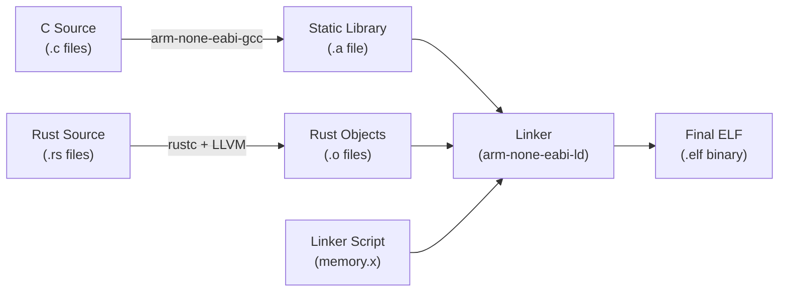
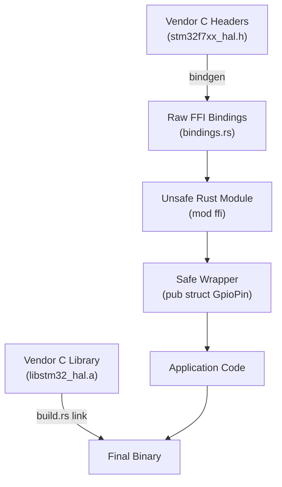

# Rust and C Interoperability

Bridging Rust and C code for embedded systems: calling vendor SDKs, exposing Rust to C firmware, and building safe abstractions over unsafe interfaces.

{: .note }
> **Prerequisites:** This chapter builds on [Foreign Function Interface]() from Part 4. That chapter covers general FFI concepts (`extern "C"`, `#[repr(C)]`, linking). Here we focus on the embedded-specific challenges: `no_std` types, vendor SDK integration, and safe peripheral wrappers.

## Calling C from Rust

Most embedded projects need to call into existing C code -- vendor SDK functions, CMSIS-DSP routines, or legacy drivers. In `no_std` Rust, the pattern is the same as standard FFI, but with different type imports.

### Extern Declarations

Declare C functions using `extern "C"` blocks. In `no_std`, use `core::ffi` types instead of `std::os::raw`:

```rust
#![no_std]

// core::ffi provides C-compatible types in no_std
use core::ffi::{c_char, c_int, c_uint, c_void};

extern "C" {
    /// Initialize the vendor SDK (e.g., STM32Cube HAL_Init)
    fn HAL_Init() -> c_int;

    /// Configure a GPIO pin
    fn HAL_GPIO_Init(port: *mut c_void, config: *const GpioInitTypeDef);

    /// Read a GPIO pin state
    fn HAL_GPIO_ReadPin(port: *mut c_void, pin: u16) -> c_int;

    /// Write a GPIO pin
    fn HAL_GPIO_WritePin(port: *mut c_void, pin: u16, state: c_int);
}

/// C struct mapped to GPIO_InitTypeDef
#[repr(C)]
struct GpioInitTypeDef {
    pin: u32,
    mode: u32,
    pull: u32,
    speed: u32,
}
```

{: .important }
> All calls to `extern "C"` functions are `unsafe`. The Rust compiler cannot verify C code's memory safety, null pointer behavior, or thread safety. Always wrap these calls in a safe Rust API.

### Linking a Static C Library

To link a pre-compiled C library (`.a` file), use a `build.rs` build script:

```rust
// build.rs
fn main() {
    // Tell the linker where to find the C library
    println!("cargo:rustc-link-search=native=vendor/lib");

    // Link the static library (libstm32_hal.a)
    println!("cargo:rustc-link-lib=static=stm32_hal");

    // Re-run if the library changes
    println!("cargo:rerun-if-changed=vendor/lib/libstm32_hal.a");
}
```

The build pipeline for linking C into a Rust embedded project:



### Handling C Strings

C strings are null-terminated, while Rust strings are length-prefixed. In `no_std`, use `core::ffi::CStr` to safely convert:

```rust
use core::ffi::CStr;

fn get_version(ptr: *const core::ffi::c_char) -> &'static str {
    unsafe { CStr::from_ptr(ptr).to_str().unwrap_or("unknown") }
}
```

## Exposing Rust to C

Sometimes your Rust code needs to be called from C firmware -- for example, when adding a Rust module to an existing C project.

### Creating a Rust Static Library

Configure your crate to produce a static library that C can link against:

```toml
# Cargo.toml
[lib]
crate-type = ["staticlib"]   # Produces libmylib.a
```

Export functions with `#[no_mangle]` and `extern "C"`:

```rust
#![no_std]
use core::panic::PanicInfo;

/// Called from C to initialize the Rust subsystem
#[no_mangle]
pub extern "C" fn rust_sensor_init(i2c_base: u32) -> i32 {
    // Initialize Rust state using the I2C peripheral base address
    // Return 0 for success, negative for error
    0
}

/// Called from C to read the sensor
#[no_mangle]
pub extern "C" fn rust_sensor_read() -> i32 {
    // Read sensor value and return it
    42
}

#[panic_handler]
fn panic(_info: &PanicInfo) -> ! {
    loop {}
}
```

The C firmware links against the Rust static library and calls these functions directly:

```c
/* main.c — C firmware calling Rust */
extern int32_t rust_sensor_init(uint32_t i2c_base);
extern int32_t rust_sensor_read(void);

int main(void) {
    HAL_Init();
    rust_sensor_init(0x40005400);  /* I2C1 base address */
    int32_t value = rust_sensor_read();
    /* ... */
}
```

### Generating C Headers with cbindgen

Use **cbindgen** to auto-generate C headers from your Rust exports instead of writing them by hand:

```bash
# Install and run cbindgen
cargo install cbindgen
cbindgen --config cbindgen.toml --output include/rust_sensor.h
```

Configure `cbindgen.toml` to control the output format, include guard name, and which types to export. This keeps C headers in sync with your `#[no_mangle] extern "C"` functions automatically.

## Bindgen for Embedded

**bindgen** automatically generates Rust FFI bindings from C header files. For `no_std` embedded projects, it needs special configuration.

### Build Script with no_std Support

```rust
// build.rs
fn main() {
    println!("cargo:rerun-if-changed=vendor/include/stm32f7xx_hal.h");

    let bindings = bindgen::Builder::default()
        .header("vendor/include/stm32f7xx_hal.h")
        .use_core()                          // core:: instead of std::
        .ctypes_prefix("core::ffi")          // core::ffi::c_int
        .allowlist_function("HAL_GPIO_.*")   // Only bind what you need
        .allowlist_function("HAL_UART_.*")
        .allowlist_type("GPIO_InitTypeDef")
        .allowlist_var("GPIO_PIN_.*")
        .derive_default(true)                // #[derive(Default)] on structs
        .layout_tests(false)                 // No layout tests in no_std
        .clang_arg("-target").clang_arg("arm-none-eabi")
        .clang_arg("-mcpu=cortex-m7")
        .clang_arg("-DSTM32F769xx")
        .clang_arg("-Ivendor/include")
        .generate()
        .expect("Failed to generate bindings");

    let out = std::path::PathBuf::from(std::env::var("OUT_DIR").unwrap());
    bindings.write_to_file(out.join("bindings.rs")).unwrap();
}
```

### Using Generated Bindings

```rust
#![no_std]
#![no_main]

#[allow(non_upper_case_globals)]
#[allow(non_camel_case_types)]
#[allow(non_snake_case)]
mod ffi {
    include!(concat!(env!("OUT_DIR"), "/bindings.rs"));
}
```

{: .tip }
> Use `allowlist_function` and `allowlist_type` aggressively. Generating bindings for an entire vendor SDK produces thousands of lines and bloats your binary. Only bind what you actually call.

## CMSIS and Vendor SDK Integration

Real embedded projects often need to integrate with vendor-provided C libraries like STM32Cube HAL, CMSIS-DSP, or Nordic nrfx drivers.

### Integration Workflow

The complete workflow from vendor C headers to safe Rust code:



### Calling CMSIS-DSP Functions

CMSIS-DSP provides optimized signal processing for Cortex-M. Declare bindings for the functions you need and link the appropriate library variant:

```rust
extern "C" {
    fn arm_fir_init_f32(
        instance: *mut ArmFirInstanceF32,
        num_taps: u16,
        coeffs: *const f32,
        state: *mut f32,
        block_size: u32,
    );

    fn arm_fir_f32(
        instance: *const ArmFirInstanceF32,
        src: *const f32,
        dst: *mut f32,
        block_size: u32,
    );
}

#[repr(C)]
struct ArmFirInstanceF32 {
    num_taps: u16,
    p_state: *mut f32,
    p_coeffs: *const f32,
}
```

In `build.rs`, link both the HAL and CMSIS-DSP libraries and combine with bindgen:

```rust
// build.rs — linking STM32Cube HAL + CMSIS-DSP
fn main() {
    println!("cargo:rustc-link-search=native=vendor/STM32CubeF7/lib");
    println!("cargo:rustc-link-lib=static=stm32f7xx_hal");
    println!("cargo:rustc-link-search=native=vendor/CMSIS/DSP/lib");
    println!("cargo:rustc-link-lib=static=arm_cortexM7lfsp_math");

    // Reuse the same bindgen pattern from above, adding HAL-specific allowlists
}
```

## Safe Wrapper Patterns

Raw FFI bindings are `unsafe` and error-prone. The key to using C code safely in Rust is wrapping it in types that enforce correct usage at compile time.

### Ownership-Based Wrappers

Map C resource lifecycle (init/use/deinit) to Rust's ownership model (new/methods/Drop):

```rust
use core::ffi::c_void;

extern "C" {
    fn uart_init(base: u32, baud: u32) -> *mut c_void;
    fn uart_send(handle: *mut c_void, data: *const u8, len: u32) -> i32;
    fn uart_deinit(handle: *mut c_void);
}

/// Safe wrapper around C UART driver
pub struct Uart {
    handle: *mut c_void,
}

impl Uart {
    pub fn new(base_address: u32, baud_rate: u32) -> Option<Self> {
        let handle = unsafe { uart_init(base_address, baud_rate) };
        if handle.is_null() { None } else { Some(Uart { handle }) }
    }

    pub fn send(&mut self, data: &[u8]) -> Result<usize, UartError> {
        let rc = unsafe { uart_send(self.handle, data.as_ptr(), data.len() as u32) };
        if rc >= 0 { Ok(rc as usize) } else { Err(UartError::from_code(rc)) }
    }
}

impl Drop for Uart {
    fn drop(&mut self) {
        unsafe { uart_deinit(self.handle) };
    }
}
```

With this wrapper, the C driver's lifecycle is tied to Rust ownership:
- **Construction** calls `uart_init` and checks for failure
- **Usage** is through safe methods that handle pointer arithmetic
- **Cleanup** happens automatically via `Drop` -- no way to forget `uart_deinit`

### Typestate Pattern for Hardware State Machines

Use Rust's type system to enforce that operations happen in the correct order:

```rust
use core::marker::PhantomData;

/// Typestate markers
pub struct Unconfigured;
pub struct Configured;
pub struct Running;

/// SPI peripheral with compile-time state tracking
pub struct Spi<State> {
    base_address: u32,
    _state: PhantomData<State>,
}

impl Spi<Unconfigured> {
    pub fn new(base: u32) -> Self {
        Spi { base_address: base, _state: PhantomData }
    }

    /// Configure SPI. Consumes self, returns Configured state.
    pub fn configure(self, clock_div: u8, mode: u8) -> Spi<Configured> {
        // unsafe { spi_configure(self.base_address, clock_div, mode); }
        Spi { base_address: self.base_address, _state: PhantomData }
    }
}

impl Spi<Configured> {
    pub fn enable(self) -> Spi<Running> {
        // unsafe { spi_enable(self.base_address); }
        Spi { base_address: self.base_address, _state: PhantomData }
    }
}

impl Spi<Running> {
    /// Transfer data -- only callable in Running state.
    pub fn transfer(&mut self, tx: &[u8], rx: &mut [u8]) -> Result<(), SpiError> {
        // unsafe { spi_transfer(self.base_address, ...); }
        Ok(())
    }

    pub fn disable(self) -> Spi<Configured> {
        // unsafe { spi_disable(self.base_address); }
        Spi { base_address: self.base_address, _state: PhantomData }
    }
}
```

```mermaid
stateDiagram-v2
    [*] --> Unconfigured: Spi::new()
    Unconfigured --> Configured: .configure()
    Configured --> Running: .enable()
    Running --> Configured: .disable()
    Running: transfer() available
    Unconfigured: Only configure() available
    Configured: Only enable() available
```

The compiler ensures you cannot call `transfer()` before `configure()` and `enable()`. Calling methods in the wrong order is a compile-time error, not a runtime bug.

### Error Code Conversion

C functions return integer error codes. Define a Rust enum and convert at the FFI boundary:

```rust
#[derive(Debug, Clone, Copy, PartialEq, Eq)]
pub enum UartError {
    Timeout,
    FramingError,
    ParityError,
    Overrun,
    Unknown(i32),
}

impl UartError {
    pub fn from_code(code: i32) -> Self {
        match code {
            -1 => UartError::Timeout,
            -2 => UartError::FramingError,
            -3 => UartError::ParityError,
            -4 => UartError::Overrun,
            other => UartError::Unknown(other),
        }
    }
}
```

This is the `UartError` type referenced in the `Uart::send` method above. The pattern applies to any C driver -- map each negative return code to a meaningful variant and include an `Unknown(i32)` catch-all.

### Combining All Three Patterns

In practice, a well-designed wrapper combines all three techniques. The ownership wrapper above already demonstrates this: `Uart::new` handles construction with null checks, `send`/`recv` convert error codes to `Result`, and `Drop` ensures cleanup. Adding typestate (as shown with `Spi`) makes invalid state transitions a compile-time error rather than a runtime bug.

## Other Platforms

{: .warning }
> **Using a different board?** The C interop patterns are the same, but the vendor libraries differ:
>
> | Platform | SDK / Driver Library | Bindgen Target |
> |:---------|:---------------------|:---------------|
> | **nRF52840** | Nordic nrfx drivers, nRF5 SDK | `--target=thumbv7em-none-eabihf` |
> | **ESP32-C3** | ESP-IDF C components | `--target=riscv32imc-unknown-none-elf` |
> | **STM32F4** | STM32CubeF4 HAL/LL | `--target=thumbv7em-none-eabihf` |
>
> For ESP-IDF specifically, the `esp-idf-sys` crate handles bindgen and linking automatically. For Nordic, the `nrf-softdevice` crate provides safe Rust wrappers over the SoftDevice BLE stack.

## Best Practices

- **Minimize the FFI surface** -- bind only the functions you need, not the entire vendor SDK
- **Always wrap unsafe in safe APIs** -- never expose raw FFI functions to application code
- **Use ownership for resource lifecycle** -- map C init/deinit to Rust constructors and `Drop`
- **Convert error codes eagerly** -- translate C integer codes to `Result<T, E>` at the boundary
- **Test wrappers in isolation** -- mock the C functions in unit tests to verify your safe layer
- **Pin your bindgen output** -- check generated bindings into version control so builds are reproducible without the C toolchain
- **Prefer `core::ffi` types** -- use `c_int`, `c_char`, `c_void` from `core::ffi` in `no_std` environments

## Next Steps

With C interop mastered, learn how to reduce your firmware's flash and RAM footprint in [Binary Size Optimization]().

[Example Code](https://github.com/MichaelTien8901/rust-guide-tutorial/tree/main/examples/part8/c-interop)
