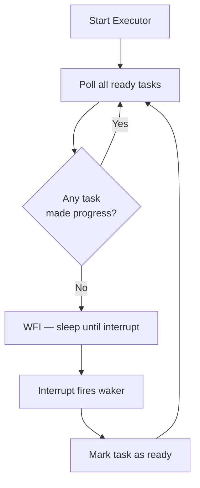
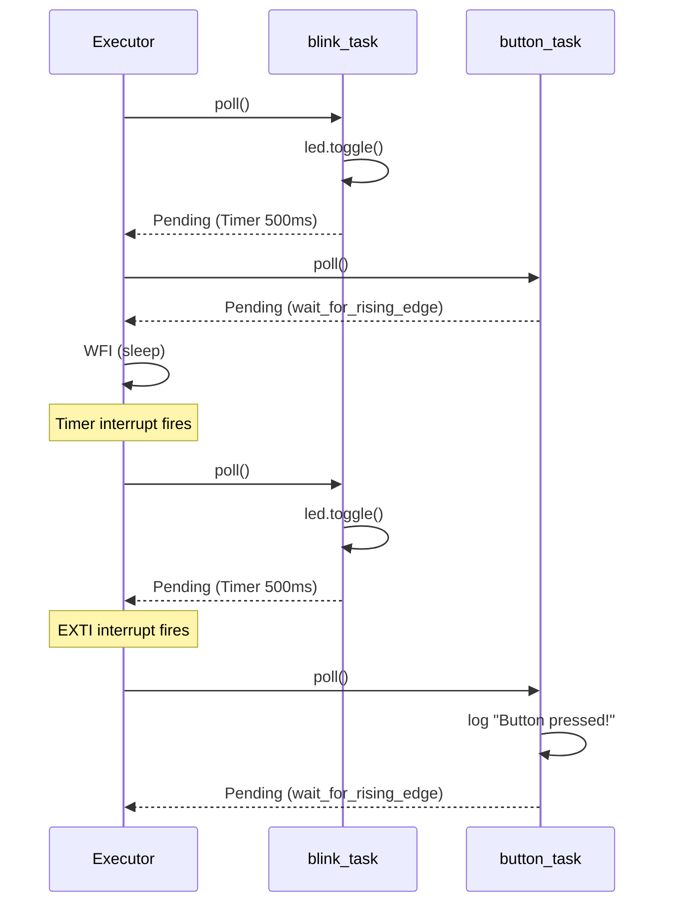

# Async Concurrency with Embassy

Running multiple concurrent tasks on a single-core microcontroller without an OS.

{: .note }
> **Prerequisites:** This chapter builds on [RTOS and Concurrency]() from Part 6 and is the most advanced chapter in Part 8. Complete all prior Part 8 chapters before continuing.

## Async/Await for Embedded

Rust's `async`/`await` syntax works without the standard library. At the language level, `async fn` returns a **Future** — a state machine that the compiler generates from your sequential-looking code. An **executor** repeatedly polls each future until it returns `Poll::Ready`.

### Core Concepts

| Concept | Role |
|:--------|:-----|
| **Future** | A value that will be available later (`Poll::Pending` or `Poll::Ready`) |
| **Polling** | The executor calls `Future::poll()` to advance the state machine |
| **Pinning** | Guarantees the future will not move in memory (required for self-referential state) |
| **Waker** | A callback the executor registers so hardware interrupts can wake a pending future |

### Why Async Beats Threads on Embedded

On a Cortex-M7 with 512 KB of RAM and no OS, threads are expensive — each needs its own stack (typically 1-4 KB). Async tasks share a single stack and only store their suspended state, which is often just a few dozen bytes.

| Approach | Stack Cost | Context Switch | Requires OS |
|:---------|:-----------|:---------------|:------------|
| OS threads (RTOS) | 1-4 KB per thread | Hardware-assisted | Yes |
| Async tasks | Shared stack, tiny state | Compiler-generated yields | No |
| Busy-wait polling | Shared stack | None (wastes CPU) | No |

### Executor Loop

The executor is a simple loop that polls ready futures. Embassy makes this interrupt-driven: instead of busy-polling, the CPU sleeps until a hardware interrupt fires a waker.



### Busy-Wait vs Interrupt-Driven

```rust
// Busy-wait polling (wastes CPU cycles)
loop {
    if uart_data_ready() {
        process(uart_read());
    }
    if timer_expired() {
        toggle_led();
    }
    // CPU runs at 100% even when idle
}

// Async with Embassy (CPU sleeps between events)
#[embassy_executor::task]
async fn uart_task(mut usart: UartRx<'static>) {
    let mut buf = [0u8; 64];
    loop {
        let n = usart.read_until_idle(&mut buf).await.unwrap();
        process(&buf[..n]);
    }
}

#[embassy_executor::task]
async fn blink_task(mut led: Output<'static>) {
    loop {
        led.toggle();
        Timer::after(Duration::from_millis(500)).await;
    }
}
// CPU sleeps (WFI) whenever both tasks are awaiting
```

## Embassy Executor

[Embassy](https://embassy.dev) is the leading async runtime for embedded Rust. It provides an executor, HAL drivers for STM32/nRF/ESP, and timer/channel primitives — all `no_std` and zero-allocation.

### Key Components

| Crate | Purpose |
|:------|:--------|
| `embassy-executor` | The async task executor |
| `embassy-time` | Timer futures (`Timer::after`, `Ticker`) |
| `embassy-stm32` | Async HAL drivers for STM32 peripherals |
| `embassy-sync` | Channels, mutexes, signals for task communication |

### Minimal Embassy Application

```rust
#![no_std]
#![no_main]

use embassy_executor::Spawner;
use embassy_stm32::gpio::{Level, Output, Speed};
use embassy_time::{Duration, Timer};
use defmt_rtt as _;
use panic_probe as _;

#[embassy_executor::main]
async fn main(_spawner: Spawner) {
    // Initialize the HAL — configures clocks, enables peripherals
    let p = embassy_stm32::init(Default::default());

    // Configure PJ13 as output (green LED on STM32F769I-DISCO)
    let mut led = Output::new(p.PJ13, Level::Low, Speed::Low);

    loop {
        led.set_high();
        Timer::after(Duration::from_millis(500)).await;  // Non-blocking!
        led.set_low();
        Timer::after(Duration::from_millis(500)).await;
    }
}
```

The `#[embassy_executor::main]` macro sets up the executor, vector table, and clock configuration. The `async fn main` is the root task — it runs like a normal `main()` but can `.await` futures.

{: .important }
> Embassy's executor is **interrupt-driven**. When a task calls `.await` on a timer or peripheral, the executor puts the CPU to sleep with `WFI`. A hardware interrupt (timer compare, UART RX, etc.) fires the waker, and the executor resumes the task. There is no busy-polling.

## Task Spawning

Embassy supports spawning independent tasks that run concurrently on the single-core executor.

### Spawning Tasks

```rust
use embassy_executor::Spawner;
use embassy_stm32::gpio::{Input, Level, Output, Pull, Speed};
use embassy_time::{Duration, Timer};

#[embassy_executor::main]
async fn main(spawner: Spawner) {
    let p = embassy_stm32::init(Default::default());

    let led = Output::new(p.PJ13, Level::Low, Speed::Low);
    let button = Input::new(p.PA0, Pull::Down);

    // Spawn independent tasks
    spawner.spawn(blink_task(led)).unwrap();
    spawner.spawn(button_task(button)).unwrap();

    // Main task can do its own work or just idle
    loop {
        Timer::after(Duration::from_secs(60)).await;
    }
}

#[embassy_executor::task]
async fn blink_task(mut led: Output<'static>) {
    loop {
        led.toggle();
        Timer::after(Duration::from_millis(500)).await;
    }
}

#[embassy_executor::task]
async fn button_task(mut button: Input<'static>) {
    loop {
        button.wait_for_rising_edge().await;
        defmt::info!("Button pressed!");
    }
}
```

### Cooperative Scheduling

Embassy uses **cooperative multitasking**: tasks voluntarily yield at every `.await` point. The executor never preempts a running task.



{: .tip }
> Each `#[embassy_executor::task]` function must have a `'static` signature — it cannot borrow local variables from `main`. Pass owned values (peripherals, channels) as arguments.

## Timer and Delay Futures

Embassy provides non-blocking timer primitives backed by hardware timer peripherals.

### One-Shot Delays

```rust
use embassy_time::{Duration, Timer, Instant};

// Delay for a fixed duration (non-blocking — other tasks run)
Timer::after(Duration::from_millis(500)).await;

// Delay until a specific instant
let deadline = Instant::now() + Duration::from_secs(2);
Timer::at(deadline).await;
```

### Periodic Ticker

For tasks that must run at a fixed rate (e.g., sensor sampling), `Ticker` compensates for execution time drift:

```rust
use embassy_time::{Duration, Ticker};

#[embassy_executor::task]
async fn sensor_task() {
    let mut ticker = Ticker::every(Duration::from_millis(100));
    loop {
        // Runs every 100ms regardless of how long read_sensor() takes
        let value = read_sensor();
        process(value);
        ticker.next().await;  // Wait for next tick
    }
}
```

### Non-Blocking vs Blocking Delay

| Method | Blocks Executor | Other Tasks Run | Use Case |
|:-------|:----------------|:----------------|:---------|
| `Timer::after().await` | No | Yes | Normal async delay |
| `Ticker::every()` | No | Yes | Periodic sampling |
| `cortex_m::asm::delay()` | **Yes** | **No** | Sub-microsecond spin |
| `embassy_time::block_for()` | **Yes** | **No** | Short critical timing |

{: .warning }
> **Never** use `cortex_m::asm::delay()` or `block_for()` for long delays in async tasks. They block the entire executor, starving all other tasks. Use `Timer::after().await` instead.

## Interrupt-Driven Peripheral Futures

Embassy's HAL drivers wrap peripheral interrupts as futures. Reading from UART, SPI, or I2C becomes a simple `.await` — the task sleeps until the hardware signals completion.

### Async UART Echo

This example echoes received bytes back over UART1 (PA9 TX / PB7 RX on the STM32F769-DISCO ST-LINK VCP):

```rust
#![no_std]
#![no_main]

use embassy_executor::Spawner;
use embassy_stm32::usart::{Config, Uart};
use embassy_stm32::bind_interrupts;
use defmt_rtt as _;
use panic_probe as _;

// Bind the USART1 interrupt to Embassy's handler
bind_interrupts!(struct Irqs {
    USART1 => embassy_stm32::usart::InterruptHandler<embassy_stm32::peripherals::USART1>;
});

#[embassy_executor::main]
async fn main(_spawner: Spawner) {
    let p = embassy_stm32::init(Default::default());

    let config = Config::default();  // 115200 8N1
    let mut usart = Uart::new(
        p.USART1, p.PB7, p.PA9, Irqs, p.DMA1_CH0, p.DMA1_CH1, config,
    ).unwrap();

    defmt::info!("UART echo started");

    let mut buf = [0u8; 64];
    loop {
        // Await incoming data — task sleeps, other tasks run
        let n = usart.read_until_idle(&mut buf).await.unwrap();
        // Echo back
        usart.write(&buf[..n]).await.unwrap();
    }
}
```

### Async SPI Transfer

```rust
use embassy_stm32::spi::{Config, Spi};

let mut spi = Spi::new(
    p.SPI2, p.PB10, p.PC3, p.PC2,
    p.DMA1_CH2, p.DMA1_CH3,
    Config::default(),
);

let tx_buf = [0x9F, 0x00, 0x00, 0x00];  // Read JEDEC ID
let mut rx_buf = [0u8; 4];

// Full-duplex transfer — task sleeps until DMA completes
spi.transfer(&mut rx_buf, &tx_buf).await.unwrap();
defmt::info!("JEDEC ID: {:02x}", rx_buf);
```

### Async I2C Transaction

```rust
use embassy_stm32::i2c::{Config, I2c};

let mut i2c = I2c::new(
    p.I2C1, p.PB8, p.PB9,
    Irqs, p.DMA1_CH4, p.DMA1_CH5,
    embassy_stm32::time::Hertz(100_000),
    Config::default(),
);

let sensor_addr = 0x48u8;
let mut temp = [0u8; 2];
i2c.read(sensor_addr, &mut temp).await.unwrap();
let temperature = i16::from_be_bytes(temp) as f32 / 256.0;
```

## Channel-Based Communication

When tasks need to exchange data, Embassy provides synchronization primitives in `embassy-sync`.

### Bounded Channel (Backpressure)

```rust
use embassy_sync::channel::Channel;
use embassy_sync::blocking_mutex::raw::CriticalSectionRawMutex;

// Channel with capacity 4 — sender blocks if full
static SENSOR_CHANNEL: Channel<CriticalSectionRawMutex, u16, 4> = Channel::new();

#[embassy_executor::task]
async fn producer_task() {
    let mut ticker = Ticker::every(Duration::from_millis(100));
    loop {
        let value = read_adc();
        SENSOR_CHANNEL.send(value).await;  // Blocks if channel full
        ticker.next().await;
    }
}

#[embassy_executor::task]
async fn consumer_task() {
    loop {
        let value = SENSOR_CHANNEL.receive().await;  // Blocks if empty
        if value > THRESHOLD {
            defmt::warn!("Sensor value {} exceeds threshold!", value);
            trigger_alarm();
        }
    }
}
```

### Signal (Latest Value)

`Signal` keeps only the most recent value — new sends overwrite the previous. Useful for configuration updates or status reporting where only the latest value matters.

```rust
use embassy_sync::signal::Signal;
use embassy_sync::blocking_mutex::raw::CriticalSectionRawMutex;

static MODE_SIGNAL: Signal<CriticalSectionRawMutex, OperatingMode> = Signal::new();

#[embassy_executor::task]
async fn control_task() {
    loop {
        let mode = MODE_SIGNAL.wait().await;
        match mode {
            OperatingMode::Normal => { /* ... */ }
            OperatingMode::LowPower => { /* ... */ }
        }
    }
}
```

### Async Mutex

For shared resources that require exclusive access:

```rust
use embassy_sync::mutex::Mutex;
use embassy_sync::blocking_mutex::raw::CriticalSectionRawMutex;

static DISPLAY: Mutex<CriticalSectionRawMutex, RefCell<Option<Display>>> =
    Mutex::new(RefCell::new(None));

#[embassy_executor::task]
async fn status_task() {
    loop {
        let display = DISPLAY.lock().await;
        // Exclusive access to the display
        display.borrow_mut().as_mut().unwrap().draw_status();
        // Lock released when `display` is dropped
        Timer::after(Duration::from_secs(1)).await;
    }
}
```

## Cooperative Multitasking Best Practices

### The Starvation Problem

Because Embassy is cooperative, a task that never yields blocks the entire system:

```rust
// BAD: blocks the executor — no other task runs
#[embassy_executor::task]
async fn compute_task() {
    loop {
        // CPU-intensive work with no .await point
        for i in 0..1_000_000 {
            heavy_computation(i);
        }
        // Other tasks are starved for the entire loop!
    }
}

// GOOD: yield periodically to let other tasks run
#[embassy_executor::task]
async fn compute_task() {
    loop {
        for chunk in data.chunks(64) {
            process_chunk(chunk);
            embassy_futures::yield_now().await;  // Yield to executor
        }
    }
}
```

### Breaking Up Long Computations

If your task does heavy processing (CRC calculation, signal filtering, image processing), break it into chunks and yield between them:

```rust
#[embassy_executor::task]
async fn crc_task(data: &'static [u8]) {
    let mut crc = 0xFFFFu16;
    for chunk in data.chunks(128) {
        for byte in chunk {
            crc = update_crc(crc, *byte);
        }
        // Yield every 128 bytes so other tasks can run
        embassy_futures::yield_now().await;
    }
    defmt::info!("CRC: {:#06x}", crc);
}
```

### Diagnosing Task Starvation

Symptoms of a blocked executor:

| Symptom | Likely Cause |
|:--------|:-------------|
| LED blink freezes periodically | Another task has a long computation without yields |
| UART drops characters | RX task not polled fast enough — another task blocks |
| Timer callbacks fire late | Executor cannot service timer wakers promptly |
| `defmt` output stops | The logging task is starved |

**Diagnosis approach:**
1. Add `defmt::info!` timestamps at `.await` points to measure gaps
2. Use a hardware timer + GPIO toggle to measure per-task execution time on an oscilloscope
3. Temporarily disable suspect tasks to isolate the blocker

## Other Platforms

{: .warning }
> **Using a different board?** Embassy supports multiple chip families:
>
> | Platform | HAL Crate | Notes |
> |:---------|:----------|:------|
> | **nRF52840** | `embassy-nrf` | BLE SoftDevice integration, excellent power management |
> | **ESP32-C3/S3** | `embassy-esp` (`esp-hal-embassy`) | Wi-Fi/BLE async drivers via `esp-wifi` |
> | **RP2040** | `embassy-rp` | Dual-core support, PIO async drivers |
> | **STM32 (all)** | `embassy-stm32` | Broadest peripheral coverage |
>
> The `embassy-executor` and `embassy-sync` crates are platform-independent. Task code using channels, timers, and signals ports across chips unchanged — only HAL initialization differs.

## Best Practices

- **Never block in async tasks** — use `.await` for all waiting; never `loop {}` or `cortex_m::asm::delay()` for long durations
- **Yield in CPU-intensive work** — call `embassy_futures::yield_now().await` every few hundred microseconds
- **Use channels over shared state** — `Channel` and `Signal` are safer and easier to reason about than `Mutex<RefCell<...>>`
- **Prefer `Ticker` over `Timer` loops** — `Ticker::every()` compensates for execution time drift
- **Keep tasks small** — each task should do one thing; compose behavior through channels
- **Use `defmt` for logging** — it is fast, zero-allocation, and works with Embassy's `defmt-rtt` probe logging
- **Bind interrupts explicitly** — the `bind_interrupts!` macro makes interrupt routing visible and auditable

## What's Next

This is the final chapter of Part 8. You have covered the complete embedded Rust development workflow:

1. **Toolchain Setup** — cross-compilation, probe-rs, cargo-embed
2. **Embedded Software** — HAL drivers, type-state GPIO, UART, timers
3. **Debugging** — GDB, RTT logging, defmt, fault analysis
4. **Bare Metal Runtime** — boot sequence, vector table, linker scripts
5. **Memory Management** — stack, heap, static allocation in constrained systems
6. **C Interoperability** — FFI, bindgen, mixing Rust and C firmware
7. **Binary Optimization** — size reduction, LTO, panic handlers
8. **Async Concurrency** — Embassy executor, tasks, channels (this chapter)

**Suggested next steps:**

- Browse the [Embassy examples repository](https://github.com/embassy-rs/embassy/tree/main/examples) for more advanced patterns (USB, Ethernet, BLE)
- Experiment with `embassy-net` for async TCP/IP networking on STM32
- Try porting your blocking HAL code from earlier chapters to async Embassy equivalents
- Explore the `embassy-boot` bootloader for OTA firmware updates
- Contribute to the Rust embedded ecosystem — file issues, improve docs, write drivers

[Example Code](https://github.com/MichaelTien8901/rust-guide-tutorial/tree/master/examples/part8/async-concurrency)
